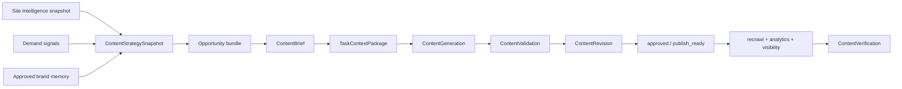

# Content Intelligence and Creation

> **Status:** proposed implementation plan, 2026-08-05.
>
> **Parent architecture:** [`growth-intelligence-platform.md`](growth-intelligence-platform.md).
>
> **Outcome:** prove the complete evidence-to-improvement loop first through industry-aware FAQ
> gap detection, frozen briefs, grounded generation, review, and recrawl verification; then extend
> the same contracts into broader content strategy and creation. Content Intelligence is more
> than a writer and never becomes an unbounded chat box.

## 1. Scope

This plan owns:

- required-question and observed-answer coverage by page role and journey;
- FAQ-first gap detection, briefs, visible content, matching structured-data drafts, and verification;
- content inventory and portfolio analysis;
- content gaps and prioritized strategy;
- deterministic task specifications and evidence-grounded briefs;
- task-scoped context assembly for content work;
- skill/template selection and provider-neutral generation;
- validation, immutable outputs, revisions, approvals, and exports;
- publication-state recording without automatic CMS mutation;
- recrawl and later demand/visibility verification.

Site Intelligence owns page evidence and knowledge extraction. Demand Intelligence owns observed
demand and prompt strategy. The Growth Agent may orchestrate this workflow through typed tools,
but `domain/content` remains the canonical owner.

## 2. Existing foundation

Reuse the shipped Content v1 implementation:

- `ContentGeneration` as a queued request/result with workspace idempotency;
- append-only `ContentGenerationAttempt` rows;
- generic Postgres task queue, leases, retry, cancel, and worker lifecycle;
- env-configured discovery/generative model connector;
- deterministic Website-context snapshot from Site Health;
- sanitized Markdown rendering and generation history;
- optional Opportunity linkage;
- existing content skills/directives.

Do not create a second content queue or overwrite generated output. Extend Website context into
the shared `TaskContextPackage` contract instead of maintaining two context systems.

Current gaps:

- prompt-box-first UX instead of an evidence-backed strategy;
- one generic `website_page` output;
- no content inventory, reusable brief, or page/section objective;
- no revision/review workflow or approved-memory promotion;
- no unsupported-claim, fact-consistency, or schema/visible-content validator;
- no recrawl-based verification;
- `BrandKnowledgeArtifact` is not yet a shared governed memory system.

## 3. Canonical workflow



No generated draft changes knowledge, site scores, opportunities, demand signals, or visibility
metrics. Only user approval can promote selected facts/style guidance into durable memory, and
only later observed evidence can verify publication or impact.

### First vertical slice — FAQ

FAQ is the first complete product workflow, not merely one content skill. Site Intelligence and
the active industry profile provide required questions for a page role or journey. Deterministic
coverage identifies questions that are absent, weak, stale, contradictory, unsupported, or not
linked to an appropriate next action. The user selects a bounded set and creates a frozen FAQ
brief containing only current verified assertions, approved memory, source references, prohibited
claims, required caveats, and verification criteria.

The first output types are:

1. a visible FAQ section for an existing page;
2. a standalone FAQ/support page;
3. optional `FAQPage` JSON-LD that exactly mirrors visible reviewed questions and answers.

Generation cannot fill an unknown value merely to complete an answer. Conflicting or historical
facts block authoritative output until review. A modified fixture/recrawl must later prove that
visible answers and any markup were observed before the source action is resolved.

## 4. Content inventory and strategy

### 4.1 Inventory

Project the Site Intelligence corpus into content units:

- page/document, industry role, purpose, audience, offering/entity, journey stage, topics;
- sections, questions/answers, claims, proof, schema, calls to action, and internal links;
- current/historical/duplicate status, freshness, coverage, and evidence quality;
- observed demand and visibility links when those artifacts exist.

The inventory is a persisted projection over source analyses. It never refetches content.

### 4.2 Gap families

- missing page or asset;
- missing or incomplete section;
- unanswered or weakly answered question;
- unsupported, inconsistent, or stale claim;
- poor audience, intent, or journey alignment;
- duplicate or competing content;
- weak evidence, authorship, or trust support;
- poor internal discovery or page relationships;
- schema/content mismatch;
- high demand with weak content or visibility;
- useful content with weak demand capture or conversion support.

Semantic analyzers may identify or explain nuanced gaps from bounded evidence. Deterministic
validators own identifiers, metric inputs, hard constraints, duplication hashes, and final
contract validation. Every model-derived gap records its context manifest and model provenance.

### 4.3 `ContentStrategySnapshot`

One immutable snapshot freezes:

- project, industry pack, source Site/Demand snapshot ids, and time window;
- content portfolio coverage by role, topic, audience, offering, and journey;
- strengths, gaps, contradictions, and unavailable evidence;
- prioritized create/update/consolidate/retire/link/schema actions;
- recommended content program and sequencing;
- source/analyzer/strategy/formula versions.

The strategy is the primary Content Intelligence object. A generated calendar or prose report is
a projection of it.

## 5. `ContentBrief` contract

A brief is a frozen, reusable instruction artifact containing no generated prose.

Required fields:

- kind: new page, page refresh, section, FAQ, guide, comparison, category, PDP, schema, or other
  pack-defined kind;
- target page/entity/offering/audience/journey/topic and intended outcome;
- primary question/intent and supporting questions;
- required sections, content units, schema, calls to action, and internal links;
- verified facts and approved-memory items allowed for use;
- conflicting, stale, prohibited, regulated, or unverified claims;
- source evidence and demand/visibility/opportunity ids;
- tone/style constraints selected from approved memory;
- success and post-publication verification criteria;
- industry-pack, brief-builder, rule, and evidence versions;
- evidence snapshot/hash and idempotency identity.

A brief can exist without calling a model. A newer source snapshot creates a new brief version;
it never mutates the frozen evidence behind an earlier generation.

## 6. Content task context

Replace the current ten-page Website-context cap with a task-aware `TaskContextPackage` builder.
The content policy selects only evidence relevant to the brief:

- approved identity, offering, audience, positioning, style, and factual constraints;
- target page and directly related pages/documents;
- supporting questions, claims, citations, proof, and internal-link targets;
- relevant Demand Signals and Visibility evidence;
- brief requirements and prohibited claims;
- pack templates and the selected content skill;
- contradictions and unavailable facts that the model must not resolve by invention.

Retrieval uses structured eligibility first, optional semantic reranking second, and config-owned
section/token budgets last. The frozen manifest records included/omitted counts and source ids.
The full site, raw analytics rows, raw HTML, secrets, and unrelated approved memory never enter a
generation request.

## 7. Skills and generation

Content skills are versioned task policies, not model memory. A skill defines:

- compatible brief kinds and industry roles;
- required context sections and capability requirements;
- system/task instructions, output schema, and validation contract;
- maximum context/output budgets and retry policy;
- skill id/version and evaluation fixture set.

Initial general skills, in delivery order:

- FAQ question-and-answer set from a frozen required-question gap;
- matching `FAQPage` JSON-LD from reviewed visible FAQ content;
- answer-first page/section;
- page refresh/consolidation;
- comparison/decision support;
- educational guide/article;
- structured-data/JSON-LD draft for other eligible roles;
- internal-link and content-maintenance checklist.

Education adds admissions, curriculum/program, facility/service, results/proof, and parent-guide
skills. Commerce adds category, PDP, comparison, buying-guide, FAQ/support, and policy skills.

### Provider-neutral gateway

Generation uses the same provider-neutral gateway contract as the Growth Agent. Environment
configuration chooses an approved adapter, model, endpoint, and credential. Adapters normalize
structured output, usage, errors, timeouts, and provenance. Domain code never branches on an
arbitrary provider string.

Measurement-engine BYOK remains separate. Content generation cannot use a measurement result as
if it were brand truth or silently send the entire competitor/brand registry.

## 8. Validation and review

Every generation produces an immutable output and an append-only attempt. Run deterministic
validation before presenting it as reviewable:

- output/schema structure and required-section coverage;
- unsupported numeric, product, institutional, medical, regulatory, or time-sensitive claims;
- conflicts with verified facts or approved memory;
- omission of required caveats or evidence;
- unsafe links/markup and sanitized rendering;
- JSON-LD syntax, allowed properties, and visible-content parity;
- duplicated sections/questions and brief non-compliance;
- internal-link target validity.

Validation flags do not rewrite the output. A regeneration creates a new immutable generation.

`ContentRevision` is the mutable human layer:

```text
draft -> in_review -> edited -> approved -> publish_ready -> published_claimed
  \-------------------------> rejected
```

`published_claimed` records user intent only. The system marks `publication_observed` separately
after a recrawl finds compatible content evidence.

Only explicit save/approve actions may promote style rules, approved facts, reusable messaging,
or editorial preferences into Approved Brand Memory. The generated body itself does not become
memory automatically.

## 9. Verification

Create `ContentVerification` projections that compare a brief/revision with later evidence:

- target content observed, absent, or materially different;
- required facts/sections/questions/schema/internal links observed;
- source findings resolved, partially resolved, or unchanged;
- comparable Site Intelligence dimension changes;
- later GSC/GA4 Demand Signal changes;
- later Visibility prompt/citation changes.

These are descriptive associations with explicit windows and coverage, not causal proof. A
content action resolves only when its defined site requirements are observed.

## 10. Persistence

Extend existing content ownership:

- `ContentStrategySnapshot` — immutable portfolio projection;
- `ContentBrief` — immutable versioned specification;
- `ContentGeneration` — existing queue/result row, extended with brief, skill, context-package,
  output-format, and validator snapshots;
- `ContentGenerationAttempt` — existing append-only provider attempts;
- `ContentValidation` — immutable validation result per generation;
- `ContentRevision` — mutable review content/state with append-only transition history;
- `ContentVerification` — immutable comparison to later Site/Demand/Visibility evidence.

Do not add a parallel `ContentDraft` table if `ContentGeneration` already owns immutable generated
output. Preserve one queue row and one canonical generated result identity.

Every row is UUID-keyed and workspace/project scoped. Reviewer ids are attribution only, never
authorization scope. Schema changes fold into `0001_initial` pre-launch.

## 11. APIs

All routes are `/api/v1`, workspace-authorized, and projection-only on reads:

- content inventory and latest/versioned strategy snapshots;
- strategy recompute task and progress;
- brief list/create/detail/version history;
- brief-to-generation enqueue;
- generation detail/history/cancel/retry;
- validation detail;
- revision create/update/state transition/export;
- publication claim and verification comparison.

Mutating endpoints use idempotency keys and coded errors. DTOs exclude provider secrets, raw
HTML, unbounded context, and private evidence not selected for display.
## 12. Frontend

`/content` becomes **Content Intelligence** with:

1. **Strategy** — portfolio coverage, priorities, program, and changes.
2. **Inventory** — pages/assets by role, topic, journey, status, and action.
3. **Briefs** — evidence, requirements, facts, constraints, and generation readiness.
4. **Drafts** — immutable outputs, validation, regeneration, and provenance.
5. **Reviews** — revisions, approval, export, and publication claim.
6. **Verification** — recrawl, demand, and visibility observations.

The first guided entry is a question/answer gap that creates an FAQ brief. The existing free-prompt
composer remains an advanced **Custom task** path. Broader strategy and Site/Demand opportunities
use the same artifacts after the FAQ loop is proven. Growth Agent actions deep-link to those
artifacts rather than maintaining a chat-only workflow.

## 13. Implementation slices and gates

### C0 — Reconcile current Content v1

- document the shipped queue/provider/context contracts;
- remove roadmap assumptions that duplicate `ContentGeneration`;
- define shared brief, skill, validation, revision, verification, strategy, and inventory schemas;
- freeze the FAQ-first output/claim/visible-schema parity contract.

**Gate:** one owner exists for every content artifact and queue transition; FAQ output cannot
bypass a brief, context package, validation, or review.

### C1 — Question coverage, FAQ briefs, and selective context

- project required questions from the active industry profile and observed question/answer units
  from Site Intelligence;
- deterministically classify missing, weak, stale, conflicting, unsupported, and complete answers;
- add idempotent FAQ briefs and version history;
- implement FAQ-specific context eligibility, budgeting, redaction, prohibited-claim handling, and
  manifest hashes;
- link source findings, page/journey roles, approved memory, and evidence.

**Gate:** The Asian School and Commerce fixtures reproduce expected question coverage; unrelated
project/site evidence never enters a brief or provider request; unknown/conflicting facts remain
blocked.

### C2 — FAQ generation and validation

- formalize visible FAQ section/page and matching-JSON-LD skills;
- adapt the current discovery client to the shared provider gateway;
- extend the existing generation queue with brief, skill, context-package, and validator snapshots;
- validate required questions, unsupported claims, caveats, duplicates, internal links, JSON-LD
  syntax, and exact visible/markup parity.

**Gate:** one Education and one Commerce FAQ brief generate reviewable output with a fake adapter,
reproducible context manifest, zero invented facts, and JSON-LD only for matching visible answers.

### C3 — FAQ review and recrawl verification

- add revisions, transitions, approval/export, and publication claim;
- require explicit save/approval for any reusable memory proposal;
- compare later page evidence with the approved brief/revision and classify each requirement as
  observed, partial, absent, or materially different;
- resolve source actions only from observed passing evidence.

**Gate:** a user can move from an evidence-backed question gap to approved visible FAQ content and
a later recrawl verification without generated material changing knowledge or a score by itself.

### C4 — Inventory, strategy, and broader skills

- project the full Site Intelligence content inventory;
- add portfolio gap analyzers, strategy snapshot, priorities, evidence, and exports;
- add answer-first page, refresh, comparison, guide, category, PDP, policy, schema, and internal-link
  skills through the proven brief/context/validation/review contracts;
- ship Education strategy modules first and Commerce second.

**Gate:** identical source snapshots reproduce the same inventory and validated strategy contract;
model-assisted conclusions retain context/model provenance, and each broader skill passes the same
claim and verification boundary proven by FAQ.

### C5 — Product experience and outcome comparison

- build the six-panel Content Intelligence workspace and contextual Growth Agent actions;
- compare later Site, Demand, and Visibility evidence using aligned windows and explicit coverage;
- surface FAQ and broader program changes without asserting unsupported causality.

**Gate:** the complete interface exposes evidence, limitations, validation, approval, and observed
verification for both FAQ-first and broader workflows.

## 14. Acceptance scenarios

### Education — first required end-to-end eval

From The Asian School fixture and Site Intelligence snapshot:

1. select an admissions or fees role with reviewed required-question labels;
2. reproduce expected missing/weak/current/conflicting answer coverage;
3. create an immutable parent-FAQ brief containing only current allowed facts and explicit unknowns;
4. generate a visible FAQ section/page with a fake provider;
5. block unknown fee/date, historical-as-current, unresolved conflict, unsupported result or
   affiliation, and any answer outside the context manifest;
6. generate `FAQPage` JSON-LD only from the reviewed visible answers;
7. approve a revision without automatically promoting its body to memory;
8. recrawl a modified fixture and verify the required questions, answers, links, and markup.

After this passes, create an admissions content strategy, existing-page refresh brief, and one
broader decision-support brief through the same contracts.

### Commerce

From the Commerce fixture, create and verify a product/category FAQ set covering suitability,
specifications, compatibility, variants, delivery, returns, care, limitations, and safety where
supported. Unknown price, rating, availability, identifiers, policy, or safety facts are requested
from the reviewer or omitted. Then prove reuse with a category or PDP enhancement brief.

## 15. Verification matrix

- pure tests for question coverage, gap states, brief idempotency, context eligibility/budgeting,
  skill selection, claim validation, visible/JSON-LD parity, and comparison;
- queue/worker tests for lease, cancellation, retry, immutable attempts/output, and provider
  normalization;
- component tests for workspace isolation, coded errors, revisions, approval, memory promotion,
  publication claim, and recrawl verification;
- frontend tests for question-gap-to-review flow, safe rendering, null/conflict/coverage states,
  evidence, and accessible mobile operation;
- model eval fixtures are versioned and provider-independent; live generation tests are opt-in.
