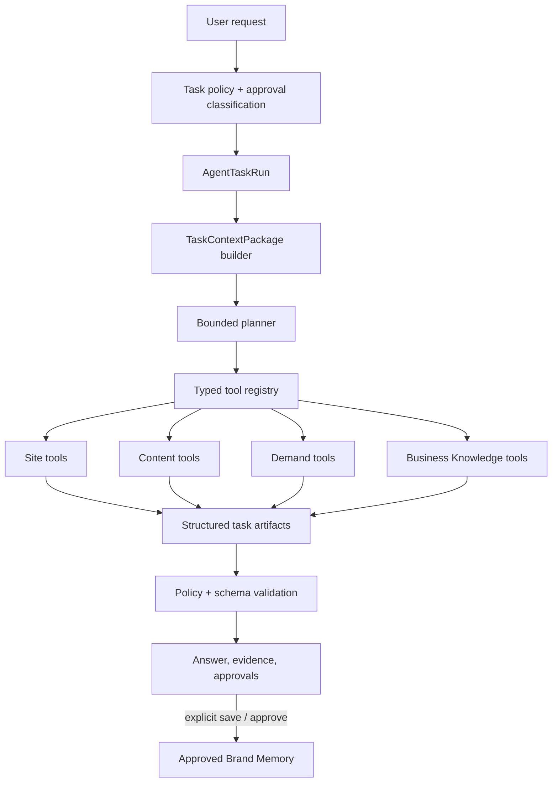

# Growth Agent and Selective Context

> **Status:** proposed implementation plan, 2026-08-05.
>
> **Parent architecture:** [`growth-intelligence-platform.md`](growth-intelligence-platform.md).
>
> **Outcome:** provide each project with a provider-neutral, evidence-grounded Growth Agent that
> can explain, plan, and execute bounded tasks across Site, Content, and Demand Intelligence while
> using only relevant context and promoting durable memory only after explicit user approval.

## 1. Product role

The Growth Agent is the connective experience, not a fourth data silo. It can:

- explain reports, findings, signals, and changes with source references;
- build prioritized roadmaps from persisted intelligence;
- propose Business Knowledge and memory updates for approval;
- create Site re-analysis requests, Content strategies/briefs/generations, Demand analyses, and
  prompt candidates through typed tools;
- compare compatible snapshots and identify what evidence is unavailable;
- guide the user through review and next actions.

It cannot:

- query another workspace or bypass domain authorization;
- crawl, sync, measure, publish, or mutate external systems outside typed authorized tools;
- activate prompts, approve memory, or publish content without explicit user action;
- treat raw chat or its own summary as company truth;
- compute headline metrics or silently override deterministic scores;
- run an unbounded autonomous loop.

## 2. Existing foundation

Reuse and deepen:

- `connectors/agent/DefaultAgentClient`, currently env-configured and OpenAI-compatible;
- `core/config/agent.py` settings and abuse controls;
- reviewed `BrandProfileSuggestion` artifacts and explicit acceptance;
- curated Brand Knowledge UI and project knowledge context;
- prompt-generation JSON parsing/validation/evidence;
- content generation queue and immutable attempts;
- existing domain APIs for Site Health, Content, Integrations, Prompts, Opportunities, and
  Visibility.

Do not turn `DefaultAgentClient` into a domain service. Evolve it into a provider gateway and
keep task planning, authorization, context, tool execution, and persistence in dedicated owners.

## 3. Architecture



Specialists are bounded analyzers/tools owned by their domains, not independent agents with
private memory. Initial specialists include:

- Site Entity and Assertion Analyzer;
- Page Role and Relevance Classifier;
- Schema and Consistency Analyzer;
- Journey Analyzer;
- Content Portfolio and Gap Analyzer;
- Brief Builder and Content Generator;
- Demand Mapper and Prompt Strategist;
- Snapshot Comparator and Roadmap Builder.

## 4. `AgentTaskRun`

Every substantial agent request becomes a durable task run with:

- workspace, project, user, conversation, and parent-run identity;
- task type, objective, requested outputs, and task-policy version;
- allowed tool set and explicit resource scope;
- required approval classes;
- frozen industry-pack and Business Knowledge versions;
- context-package id/hash;
- provider/model/capability and instruction/skill versions;
- bounded plan, step states, tool inputs/outputs, errors, and retry history;
- result artifact ids, validation, usage, latency, and final status;
- requested and completed approval events.

Suggested states:

```text
draft -> validating -> queued -> planning -> running
running -> awaiting_approval -> running
running -> completed | partially_completed | failed | cancelled
```

Use the shared Postgres queue where work crosses a provider or long-running domain task. Short
read-only explanation may run synchronously only within config-owned budgets. Never hold a DB
transaction over a provider or tool call.

## 5. Task and tool contracts

### 5.1 Bounded task catalog

The first release supports explicit task families:

- explain a selected artifact or report;
- summarize evidence and limitations;
- build or revise a prioritized roadmap;
- propose a Business Knowledge or memory item;
- create a role/journey FAQ brief as the first Content mutation;
- generate/revise visible FAQ content from an approved brief and request review;
- create broader Content strategy or brief after the FAQ path is proven;
- create or prioritize prompt candidates;
- compare Site, Content, Demand, or Visibility snapshots;
- recommend the next measurement or evidence action.

The agent cannot invent a new privileged task at runtime. New task families require a config
policy, input/output schema, allowed tools, approval rules, context policy, and eval fixtures.

### 5.2 Typed tools

A tool is a narrow domain interface, not an HTTP-shaped escape hatch. Each tool declares:

- name/version and owning domain;
- strict input/output schema;
- read-only or mutation class;
- workspace/project/resource authorization;
- idempotency behavior;
- required context artifacts and maximum result size;
- timeout, error codes, and retry class;
- approval requirement and audit fields.

The agent never receives raw database or arbitrary URL access. Domain services continue to own
business rules. Tool results use bounded projection DTOs with evidence ids.

### 5.3 Approval classes

- `none`: read persisted evidence or create a temporary explanation;
- `confirm_task`: enqueue a potentially costly crawl, sync, audit, or generation;
- `review_artifact`: accept/edit/reject a prompt, brief, strategy, or revision;
- `promote_memory`: save an item into Approved Brand Memory;
- `external_mutation`: reserved for future publishing/connectors and always explicit.

Approval is a server-enforced state transition, not wording in a prompt.

## 6. Context architecture

### 6.1 Context layers

A `TaskContextPackage` may contain:

- task instructions and selected skill;
- approved brand memory;
- relevant working knowledge with confidence/limitations;
- bounded immutable evidence excerpts;
- selected Site/Content/Demand/Visibility snapshots;
- contradictions, unavailable data, and prohibited assertions;
- output schema and validation policy.

It never contains another project, provider credentials, raw OAuth data, unbounded HTML, the
entire catalog, or the whole conversation by default.

### 6.2 Selection pipeline

1. authorize workspace/project and task scope;
2. derive required artifact types from the task policy;
3. apply entity/page/journey/topic/audience/time/approval filters;
4. prefer approved memory, current compatible snapshots, and direct evidence;
5. include contradictory evidence as an explicit context section;
6. optionally use embeddings to rerank already-authorized candidates;
7. enforce per-section and total budgets from config;
8. redact disallowed data;
9. freeze ordered items, omissions, versions, hashes, and policy identity;
10. validate that every referenced artifact still belongs to the authorized project.

The context builder is deterministic for the same eligible corpus and selection policy except
where an explicitly versioned semantic reranker participates. Its reranker output is persisted.

### 6.3 Context quality signals

Record:

- eligible, selected, omitted, stale, and contradictory counts;
- approved-memory versus inferred/evidence composition;
- token estimates and truncation per section;
- freshness and source coverage;
- retrieval and reranker versions;
- post-task citation use and unsupported-output flags.

These metrics enable context improvement without inspecting private prompt bodies globally.

## 7. Memory governance

### 7.1 Operational evidence is not memory

Crawls, analytics imports, audits, and model attempts persist automatically for reproducibility.
They remain evidence or working projections.

### 7.2 Promotion is explicit

Only a workspace member's `save` or `approve` action creates or updates Approved Brand Memory.
A memory proposal contains:

- typed subject, predicate, value, validity/effective dates, and scope;
- supporting evidence or `user_supplied` origin;
- contradictory assertions and confidence;
- proposing task/model and context provenance;
- approval state, approver, and transition history;
- supersession link rather than destructive overwrite.

The agent may propose corrections after new evidence but cannot silently change an approved item.
Rejecting a proposal remains audit history and should prevent identical low-value reproposals
under the same evidence/version.

### 7.3 Conversation retention

Conversation messages support continuity and auditing but are not automatically selected as
brand knowledge. A user can save a message-derived item through the same typed promotion flow.
Conversation retention and deletion policy is config-owned and independent of evidence required
for immutable task provenance.

## 8. Provider-neutral model gateway

Replace OpenAI-compatible assumptions in domain code with a capability-aware contract:

```text
ModelGateway
  validate_configuration()
  capabilities()
  complete_text()
  complete_structured()
  execute_tool_turn()
  normalize_usage()
  classify_error()
```

Approved adapters may include native providers and an OpenAI-compatible endpoint. Environment
configuration selects adapter, model, endpoint, credential, and non-secret options. All defaults,
timeouts, budgets, retry classes, and capability requirements live in `core/config/agent.py` or
an adjacent config owner.

Capabilities include:

- structured output mode;
- native tool calling;
- context/output limits;
- supported content types;
- streaming support;
- usage reporting;
- provider safety/finish metadata.

A task policy declares required capabilities. Configuration fails early when the selected model
cannot satisfy them. Tool orchestration may use a normalized application loop even when an
adapter lacks native tool calls, but it must preserve the same bounded plan and validation.

Every call records provider adapter, endpoint host, exact model, request/template/skill versions,
context hash, usage, latency, finish status, and safe error. Secrets never enter snapshots/logs.

## 9. Planning and execution

The planner receives the task, allowed tool descriptions, and context manifest. It returns a
strict bounded plan:

- maximum steps and tool calls from config;
- no recursion without a declared subtask type;
- dependency order and expected artifact per step;
- approval checkpoint before any gated step;
- terminal criteria and partial-result behavior.

The application validates the plan against policy before execution. Each tool call is separately
authorized and idempotent. The agent may revise the remaining plan only within the original task,
scope, budgets, and tool set; the revision is persisted.

Long-running domain tasks return task ids. The agent waits through persisted state/polling rather
than keeping a provider turn or database transaction open. Cancellation propagates cooperatively
to owned queued tasks where supported.

## 10. Output and trust contract

Agent responses separate:

- conclusion or proposed action;
- evidence used and relevant limitations;
- generated/inferred versus approved facts;
- artifacts created or tasks queued;
- approvals still required;
- suggested next step.

The UI resolves citations to in-product evidence/detail views. A model citation to an artifact it
did not receive is rejected by validation. Unsupported factual output is flagged and cannot be
promoted to memory.

## 11. APIs and persistence

Add canonical owners under `domain/agent` and `models/agent.py` only after reusing shared queue and
existing connector code:

- `AgentConversation` and messages for interaction history;
- `AgentTaskRun` and append-only step/tool attempt records;
- `TaskContextPackage` and bounded manifest items;
- `ApprovalRequest`/transition history or a reusable approval owner;
- memory proposal links to the shared knowledge owner;
- agent evaluation/result metadata.

APIs:

- create/list/read conversations and task runs;
- submit a task with client idempotency;
- read task plan/progress/result/evidence;
- cancel a run;
- approve/reject a gated transition;
- save/reject/supersede a memory proposal;
- list supported task/tool/model capabilities.

Streaming is optional acceleration. Polling and persisted task state remain authoritative.
All APIs require active workspace membership and return coded errors.

## 12. User experience

### Project-level Agent workspace

- task composer with supported action suggestions;
- visible current project and scope;
- plan/progress timeline for long-running work;
- structured result cards linked to Site, Content, and Demand artifacts;
- source/limitations drawer and context summary;
- approval cards with exact consequences;
- conversation history without implying every message is memory.

### Contextual actions

- Site: explain finding, map journey, build roadmap, create brief;
- Content: explain strategy, refine brief, generate/revise, compare verification;
- Demand: explain signal, create prompts, reprioritize portfolio, plan measurement;
- Business Knowledge: propose, save, reject, or supersede memory.

The agent is accessible throughout the product but does not replace the three primary
workspaces. Users can inspect and operate every underlying artifact without chat.

## 13. Evaluation and observability

Create versioned, provider-independent evaluations for:

- correct tool selection and no unauthorized tool use;
- relevant context selection and exclusion of unrelated/project-foreign evidence;
- evidence citation and unsupported-claim detection;
- plan boundedness, approval placement, and cancellation;
- structured output validity across supported providers;
- memory proposal quality and zero automatic promotion;
- Education and Commerce task correctness;
- cost, latency, context size, retries, and partial completion.

Production telemetry records safe ids, counts, timings, versions, and error codes—not full private
context or secrets. Per-workspace usage and concurrency limits are config/entitlement controlled.

## 14. Implementation slices and gates

### G0 — Contract and gateway foundation

- inventory current agent/discovery clients and callers;
- define task, tool, approval, context, memory, and capability contracts;
- evolve the provider gateway with a fake adapter and compatibility tests.

**Gate:** existing prompt/profile generation works through the gateway without behavior drift.

### G1 — Context packages

- implement task policies, artifact eligibility, structured retrieval, optional semantic rerank,
  budgets, redaction, manifests, and quality metrics;
- adapt Content and prompt generation to frozen context packages.

**Gate:** fixtures prove project isolation, relevant selection, reproducibility, and bounded size.

### G2 — Task runs and typed tools

- add durable runs, bounded plans, tool registry, queue integration, steps, retries, cancellation,
  and evidence-linked results;
- begin with read-only explain/compare, create-FAQ-brief, and create-prompt-candidate tasks.

**Gate:** no tool can execute outside the validated task policy or authorized project scope.

### G3 — Approvals and memory

- add approval state transitions and memory proposals;
- require explicit user save/approval; support rejection and supersession;
- integrate the existing Brand Knowledge review flow.

**Gate:** automated tests prove no chat, inference, generation, crawl, or sync writes Approved
Brand Memory without an audited user transition.

### G4 — Cross-domain orchestration

- add FAQ generation/review handoff first, then roadmap, broader content generation,
  demand-analysis, prompt-strategy, schedule-management, and next-measurement tasks;
- support long-running child tasks and partial outcomes.

**Gate:** The Asian School acceptance workflow can be orchestrated through typed artifacts with
bounded context and correct approvals.

### G5 — Product experience and rollout

- build project Agent workspace and contextual actions;
- add evidence/context/approval UI, capability display, usage controls, and eval dashboards;
- calibrate at least two provider adapters or one native plus OpenAI-compatible adapter.

**Gate:** provider changes require configuration only; task artifacts, memory, and domain data
remain unchanged and comparable.

## 15. Acceptance scenario

For The Asian School, the user asks: “Build a roadmap to improve qualified admissions visibility.”
The system must:

1. create a bounded run and select the Education pack;
2. assemble only relevant approved memory, current Site snapshot, admissions journey, Demand
   snapshot if available, and Visibility evidence if available;
3. expose missing analytics/visibility evidence rather than invent it;
4. call typed Site/Demand roadmap tools and return a traceable priority sequence;
5. offer an explicit action to create the highest-priority admissions FAQ brief and separate
   actions for provisional prompts;
6. ask for approval before FAQ generation, prompt activation, or recurring audit scheduling;
7. persist results as working artifacts;
8. promote nothing to Approved Brand Memory unless the user saves it;
9. reproduce the run's context manifest and model/tool provenance later.

## 16. Verification matrix

- gateway adapter/capability/error/usage tests;
- task-policy, planning, step-limit, tool-authorization, idempotency, queue, and cancellation tests;
- context isolation, relevance, contradiction, token-budget, redaction, and hash tests;
- approval and memory state-machine/component tests;
- evidence-citation and unsupported-output validation fixtures;
- frontend tests for progress, context/evidence display, approvals, accessibility, and fallback
  polling;
- end-to-end Education and Commerce agent tasks use fake providers in CI; live models are opt-in.
