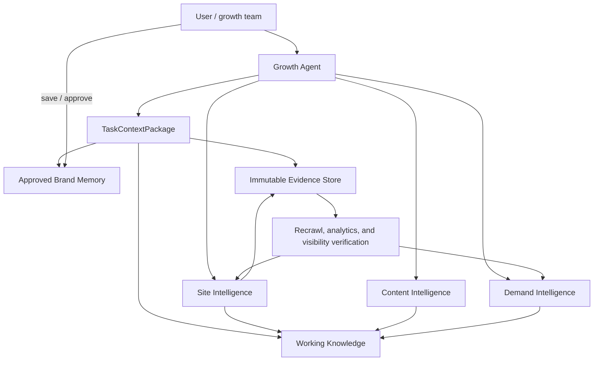
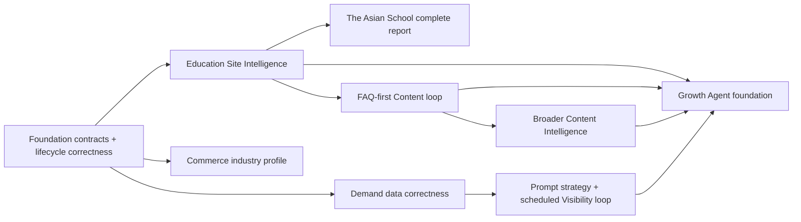

# CiteLadder Growth Intelligence Platform

> **Status:** canonical proposed architecture and implementation map, 2026-08-05.
>
> **Product decision:** CiteLadder is an evidence-grounded growth intelligence platform, not
> primarily an AI-visibility tracker. Visibility remains a measurement loop. The product's
> durable advantage is a project-specific knowledge system that powers a provider-neutral
> Growth Agent across Site Intelligence, Content Intelligence, and Demand Intelligence.
>
> **First customer and validation pack:** The Asian School (`theasianschool.net`) through a
> K-12 Education industry pack. Commerce is the second industry pack. Large marketplaces are
> acquisition stress tests, not the initial customer model.

## 1. Product thesis

CiteLadder becomes the growth partner that can answer four connected questions:

1. **What does the company currently say and prove?**
2. **What knowledge, content, journeys, and machine-readable evidence are missing or weak?**
3. **What are people demonstrably looking for and doing?**
4. **What should the company create, improve, and measure next?**

The product is organized around three primary workspaces:

- **Site Intelligence** acquires the owned corpus, builds the evidence-backed company
  knowledge model, evaluates page roles and journeys, and produces the first roadmap.
- **Content Intelligence** converts verified knowledge and prioritized gaps into strategy,
  briefs, drafts, reviewable revisions, and recrawl-based verification.
- **Demand Intelligence** combines GSC, GA4, business context, site evidence, and answer-engine
  observations into demand signals, prompt portfolios, priorities, and outcome tracking.

The **Growth Agent** sits above those domains. It plans bounded tasks, calls typed tools, and
assembles selective context. It does not own a second copy of project knowledge and cannot turn
unreviewed model output into durable brand memory.

### Resolved product decisions

| Decision | Resolution |
|---|---|
| Initial customer | The Asian School; K-12 education is the first real industry pack |
| Primary first-customer outcome | Improve the quality and measurability of admission demand, content, and visibility—not generic traffic |
| Platform shape | One master architecture with separate Site, Content, Demand, and Agent implementation plans |
| Canonical truth | Versioned evidence plus explicit derived assertions; model output is never raw truth |
| Knowledge architecture | Stable core ontology + versioned industry packs + isolated project knowledge |
| Industry order | Education first, Commerce second; no marketplace-specific architecture |
| Prompt lifecycle | Provisional → evidence-prioritized → user-edited/approved → active measurement |
| Agent shape | Bounded orchestrator over three intelligence domains, not a fourth data owner |
| Durable memory | Only explicitly saved or approved knowledge enters cross-task brand memory |
| Model strategy | Provider-neutral gateway configured from the environment; memory remains in CiteLadder |
| Reporting | Versioned in-product snapshot plus exportable executive report and evidence-backed roadmap |



## 2. First-customer outcome

The Asian School currently spends heavily on keyword optimization while reporting roughly one
percent conversion. CiteLadder must not claim the cause of that conversion rate without
behavioral evidence. Its first complete report must instead:

- inventory and classify the current owned corpus;
- distinguish current, historical, duplicate, irrelevant, and unavailable material;
- model the school, its offerings, audiences, proof, and admissions journey;
- identify page-, topic-, schema-, trust-, and journey-level gaps;
- produce a prioritized content and site-improvement roadmap;
- propose a valid, editable prompt portfolio from current evidence;
- state what GSC, GA4, and Visibility must measure next;
- preserve every conclusion's evidence, coverage, confidence, and version.

The public site is a suitable real-world corpus: it has hundreds of current URLs, a separate
blog, admissions flows, compliance evidence, events, results, and hundreds of historical
documents. The acceptance corpus must be captured as redacted, versioned fixtures so normal
tests never depend on the live site.

## 3. Product boundaries

### Included in the target architecture

- owned-site and document acquisition;
- reusable core knowledge contracts;
- Education and Commerce industry packs;
- business-context expansion with low-friction onboarding;
- deterministic and model-assisted, evidence-grounded analysis;
- content strategy, briefs, generation, and review;
- GSC/GA4 demand and journey analysis;
- generated, reviewed, and tracked prompt portfolios;
- existing multi-engine Visibility measurement;
- a bounded, provider-neutral Growth Agent;
- in-product reports plus reproducible exports.

### Not promised by these plans

- causal conversion diagnosis without adequate analytics evidence;
- paid advertising, CRM, email, or social-channel optimization in the first loop;
- autonomous publishing or external mutations;
- unrestricted self-running agents;
- a model trained on private customer data;
- automatic sharing of one customer's facts with another;
- one universal score that hides coverage or industry differences;
- replacing measurement-engine APIs with the Growth Agent model.

## 4. Canonical data layers

The term **knowledge base** refers to the complete governed system below, not a vector store or
a table of model-written summaries.

### 4.1 Immutable evidence store

Automatically persisted evidence required for reproducibility:

- crawl attempts, normalized page/document artifacts, and rule evidence;
- integration import artifacts and normalized metric rows;
- answer-engine raw artifacts, analyses, citations, and metric snapshots;
- generation request snapshots and append-only attempts;
- user actions and approval events.

Evidence may be unavailable, contradictory, or stale. Persistence means “observed,” never
“approved as true.” Existing immutable-artifact and provenance invariants remain unchanged.

### 4.2 Working knowledge

Versioned, replaceable projections produced from evidence:

- entities, relationships, claims, questions, topics, audiences, offerings, and journeys;
- page roles, content units, schema assertions, contradictions, and gaps;
- demand signals, opportunity bundles, prompt candidates, briefs, and agent plans;
- confidence, effective dates, source coverage, analyzer versions, and limitations.

Working knowledge may be recomputed or superseded. It can inform the current report, but it is
not automatically durable agent memory.

### 4.3 Approved brand memory

Only information a workspace member explicitly saves or approves is promoted into durable
cross-task memory. Approved memory:

- references its supporting evidence or records that it is user-supplied;
- records approver, timestamp, validity, and supersession;
- outranks inferred working knowledge when assembling context;
- remains workspace/project scoped;
- is never silently rewritten after a recrawl or analytics sync.

Raw chat is interaction history, not brand truth. A conversation can propose a memory item but
cannot promote it without the explicit save/approve transition.

## 5. Shared artifact vocabulary

Later implementation may consolidate storage where appropriate, but it must preserve these
public concepts and ownership boundaries.

| Artifact | Purpose | Required provenance |
|---|---|---|
| `EvidenceArtifact` | Immutable observation from a crawl, integration, audit, or generation | source run/task, content hash, acquisition/import version |
| `KnowledgeEntity` | Project-scoped organization, offering, person, location, audience, topic, product, category, or other typed entity | evidence ids, pack id/version, extractor/analyzer version |
| `KnowledgeAssertion` | A typed claim about an entity or relationship, including contradictions and effective dates | exact source spans/paths, confidence, state, analyzer version |
| `KnowledgeRelation` | Typed connection between entities, pages, journeys, questions, prompts, and evidence | source ids and relation version |
| `PageUnderstanding` | Generic page kind, industry role, purpose, audience, content units, and disposition | site analysis/artifact id, classifier versions |
| `JourneyDefinition` | A business journey and its configured outcomes, stages, supporting pages, and events | user/pack source, version, approval state |
| `IntelligenceSnapshot` | Immutable, bounded projection for one Site, Content, or Demand run | source ids, coverage, formula/analyzer versions |
| `OpportunityBundle` | Prioritized, traceable improvement targeting one entity/page/journey/action family | source snapshot/finding/signal ids, rule/formula versions |
| `ContentBrief` | Frozen task specification containing verified facts, gaps, audience, intent, constraints, and sources | knowledge/signal/opportunity ids, brief version/hash |
| `DemandSignal` | Time-bounded evidence of demand, behavior, visibility, or an unmet question | integration/traffic/visibility/site ids, time window, formula version |
| `PromptCandidate` | Proposed measurable prompt linked to audience, intent, evidence, and target knowledge | demand/site/knowledge ids, generator and validation versions |
| `TaskContextPackage` | Bounded context frozen for one agent or generation task | selected artifact ids, selection policy, token budget, manifest hash |
| `AgentTaskRun` | Persisted bounded plan, tool calls, approvals, results, and model provenance | context package, tool versions, provider/model, task policy version |

Do not create a generic untyped “memory blob” that bypasses these contracts.

## 6. Core taxonomy and industry packs

### 6.1 Stable core

The core stays industry-neutral:

- generic page kinds: identity, informational, conversion, trust, support, listing, detail,
  editorial, utility, and other;
- reusable entities, assertions, relations, topics, questions, audiences, offerings, journeys,
  content units, evidence, demand signals, prompts, and actions;
- common analyzers for crawlability, schema, entity consistency, answerability, evidence,
  freshness, duplication, internal relationships, and journey support.

### 6.2 Versioned `IndustryPack`

An industry pack is an executable, reviewed configuration package rather than a customer-data
dump. It defines:

- industry-specific page roles and classifier signals;
- expected entity and relationship types;
- expected schema types and properties;
- journey templates and business outcomes;
- content-section and question expectations;
- trust/proof requirements;
- rule mappings, priority modifiers, report modules, brief templates, and prompt archetypes;
- fixture corpus and acceptance expectations;
- pack id, semantic version, compatibility range, and migration notes.

Project evidence never trains or mutates a shared pack automatically. Generalized improvements
enter a reviewed pack release with fixtures and tests.

### 6.3 Education first, Commerce second

- **Education v1:** K-12 school identity, admissions, academics, curriculum, grades/classes,
  faculty/leadership, boarding, facilities, fees, results, activities, events, compliance,
  parent/student resources, contact, and editorial discovery content.
- **Commerce v1:** organization/store identity, category/collection, product detail, offers,
  variants, comparison, buying guides, FAQs, policies, reviews, and product/category journeys.

Commerce reuses the knowledge and content contracts. Its existing catalog remains a specialized
identity source; it must not become the universal knowledge model.

## 7. Progressive Business Knowledge

Project creation requires only the minimum needed to begin safely: organization/brand name,
owned domain, and locale/market defaults. Do not turn initial onboarding into a strategy
questionnaire.

The **Business Knowledge** workspace progressively captures optional structured context:

- offerings and strategic priorities;
- audiences/personas and locations/markets;
- primary and secondary business outcomes;
- journeys and conversion actions;
- differentiators, proof, tone/style, and regulated or prohibited claims;
- known competitors and comparison boundaries;
- editorial preferences and approved reusable messaging.

Site and Demand evidence may produce suggestions for missing context. The Growth Agent may explain
and propose values, but each value becomes Approved Brand Memory only after a user saves or
accepts it. Missing optional context reduces coverage or confidence; it does not block the first
crawl or fabricate defaults.

## 8. Analysis policy

### Deterministic ownership

Code owns URL admission, parsing, canonicalization, exact identifiers, schema syntax, metric
aggregation, joins, lifecycle state, validation, deduplication, scoring formulas, and hard
policy gates.

### Model-assisted ownership

Configured models may classify nuanced intent, extract or reconcile bounded claims, summarize
evidence, map questions and content gaps, create task plans, generate prompts, and draft content.
These outputs are derived assertions, never raw truth. Each carries:

- selected evidence and context-package hash;
- provider, model, prompt/template, skill, and analyzer versions;
- confidence and limitations;
- deterministic validation results;
- review and memory-promotion state.

No model output changes a headline metric or approved memory merely because it was generated.

## 9. Growth Agent architecture

The Growth Agent is a bounded application layer over typed domain tools:

```text
request
  -> classify task and required approvals
  -> create AgentTaskRun
  -> build/freeze TaskContextPackage
  -> create bounded plan from allowed tools
  -> execute tools through domain APIs
  -> validate and persist working result
  -> present evidence and requested approvals
  -> promote only explicitly saved/approved memory
```

The model gateway is provider-neutral. Environment configuration selects an approved adapter,
model, endpoint, and credential reference. The gateway exposes normalized capabilities for
structured output, tool use, context size, usage, errors, and provenance. Arbitrary provider
strings never leak into domain code, and a model may run only workflows matching its declared
capabilities.

The existing direct BYOK measurement routes remain separate. The Growth Agent cannot impersonate
ChatGPT, Gemini, or Claude measurements or rewrite their persisted evidence.

## 10. Selective context contract

Every substantial generative or agent task uses a frozen `TaskContextPackage`, never an
unbounded dump of the knowledge base.

Context assembly is config-owned and task-specific:

1. enforce workspace/project boundary;
2. select eligible artifact types for the requested task;
3. filter by entity, page, journey, audience, topic, industry pack, freshness, and approval;
4. rank using structured relevance plus optional semantic retrieval;
5. surface contradictions and unavailable evidence rather than hiding them;
6. allocate section and total token budgets;
7. record selected and omitted artifact counts, ids, versions, and hashes;
8. redact secrets and disallowed personal data;
9. freeze the manifest before provider I/O.

Vector embeddings are disposable retrieval projections. They are never authorization filters,
truth stores, or the only link back to evidence.

## 11. Product workflow and UI

The primary navigation becomes:

1. **Site Intelligence** — Overview, Pages, Knowledge, Schema, Journeys, Evidence.
2. **Content Intelligence** — Strategy, Inventory, Briefs, Drafts, Reviews, Verification.
3. **Demand Intelligence** — Demand, Journeys, Prompts and Schedules, AI Visibility, Evidence.

Visibility remains intact inside the Demand outcome loop while its current deep links continue
to work. Recommended Actions become contextual action bundles across the three workspaces rather
than a disconnected product.

The Growth Agent has a project-level workspace and contextual entry points throughout the app:
“Explain,” “Build roadmap,” “Create FAQ brief,” “Generate prompts,” and “Compare evidence.” The UI
always shows which sources were used, which data was unavailable, and which changes need approval.

## 12. Implementation plans and dependency graph

| Plan | Outcome | Depends on |
|---|---|---|
| [`site-intelligence-primary-product.md`](site-intelligence-primary-product.md) | Reliable acquisition, shared knowledge foundation, Education v1, Commerce v1, first complete report | existing Site Health and project foundations |
| [`content-intelligence.md`](content-intelligence.md) | FAQ-first briefs/generation/verification followed by broader strategy and content workflows | shared artifacts and Site Intelligence snapshots |
| [`demand-intelligence.md`](demand-intelligence.md) | Correct GSC/GA4 projections, Demand Signals, prompt portfolios, schedules, and Visibility loop | shared artifacts; existing integrations, prompts, Traffic, Analytics, Visibility |
| [`growth-agent.md`](growth-agent.md) | Bounded orchestration, selective context, approval-gated memory, and contextual UI | typed tools from all three intelligence domains |

Recommended delivery order:



The agent foundation can begin after the shared contracts exist, but broad orchestration ships
only when the underlying typed tools are trustworthy.

## 13. Cross-plan implementation rules

- Preserve UUIDs, workspace authorization, immutable artifacts, single-writer queue behavior,
  coded errors, same-origin APIs, and version provenance.
- Continue using the modular monolith and shared Postgres queue. Specialist intelligence
  systems are modules and tools, not autonomous microservices.
- Extend existing owners before adding storage or queues: Site Health, Content, Integrations,
  Traffic, Analytics, Prompts, Opportunities, Schedules, and Visibility already ship useful
  foundations.
- Read APIs only project persisted artifacts. They never crawl, sync, call a model, or repair
  state.
- Configuration, catalogs, thresholds, templates, context budgets, industry registry data, and
  model capabilities live under `core/config/*` or frontend config owners.
- Greenfield schema changes fold into `0001_initial`; future sessions must reset and verify a
  disposable database.
- Every plan must include offline fixtures, deterministic validations, component tests,
  workspace-isolation tests, and an opt-in live acceptance procedure.

## 14. Program-level acceptance

The architecture is accepted when one project can:

1. create a low-friction project using only brand name and domain;
2. optionally expand Business Knowledge over time;
3. acquire and classify its relevant owned corpus using a frozen industry profile;
4. produce a versioned Site Intelligence snapshot and complete report;
5. save selected findings or facts into approved brand memory;
6. detect role/journey question gaps and create a frozen evidence-grounded FAQ brief;
7. generate, validate, review, and approve visible FAQ content plus optional matching JSON-LD;
8. recrawl and verify the approved FAQ requirements without mutating earlier evidence;
9. create broader content strategy and brief types through the same contracts;
10. import GSC/GA4 data and create traceable Demand Signals;
11. generate, edit, approve, and activate a prompt portfolio;
12. run manual and scheduled Visibility measurement without blending results into site truth;
13. resync/rerun and show what changed without mutating earlier evidence;
14. ask the Growth Agent to explain and execute bounded tasks using a visible context manifest.

## 15. Success measures

- **Knowledge:** relevant-corpus coverage, page-role confidence, entity/assertion provenance,
  contradiction resolution, industry-profile eval maturity, and approved-memory reuse.
- **Site:** actionable finding precision, journey coverage, schema/content/trust improvement,
  and verified resolution after recrawl.
- **Content:** FAQ-gap precision, brief acceptance, unsupported-claim rate, visible/schema parity,
  draft-to-approved rate, time to useful revision, and post-publication verification.
- **Demand:** query-to-page coverage, landing/event join coverage, demand-signal precision,
  prompt acceptance, scheduled-run reliability, and priority stability under new data.
- **Outcome:** qualified conversion signals when configured, organic demand growth, owned
  citations, brand/product mentions, and share of voice. Outcome metrics validate strategy;
  they do not rewrite evidence.
- **Agent:** context precision, evidence citation rate, approval rate, tool success, cost and
  latency per task, and zero unauthorized memory promotion or external mutation.

## 16. Documentation transition

This document and its four companion plans supersede the historical visibility-first and
commerce-first planning retained under [`../archive/plans/`](../archive/plans/), including the
former Site Health/Commerce foundation plan and old Content and Opportunities roadmaps. Archived
files are migration context only; current shipped behavior is governed by the concise subsystem
documents and code until each gated implementation slice lands.

The first implementation session begins with [`../../Agents.md`](../../Agents.md),
[`../README.md`](../README.md), architecture, invariants, backend/frontend ownership, the relevant
canonical plan, and the current error contract. No plan text alone changes runtime behavior.
