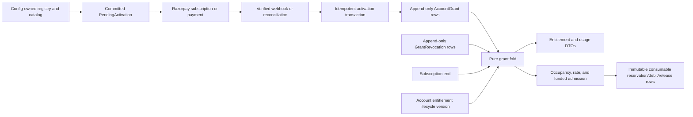

# PART B work order — v8 entitlement core and commercial surface

## Scope and delivery boundary

This work is part of PR1, the backend PR. It covers T0, T7, T8, T9, T10, and T16 from `docs/plans/v8-cost-latency-and-tier-pricing.md`:

- delete the v6 Free/Paid entitlement layer;
- add the config-owned capability registry, append-only grants, revocations, consumable ledger, pure resolver, cache, and invalidation;
- replace the billing catalog and commercial API with plan, recurring add-on, and one-time top-up contracts over the existing Razorpay rail;
- enforce occupancy, rolling-rate, consumable, budget, and topical-binding limits at owning mutation points;
- retain trial as first-class grant algebra while returning `trial_unavailable` from checkout; full trial checkout/activation/abuse work moves intact to PR3;
- expose Enterprise as contact-only and fulfill it only through audited `override` grants;
- add an opt-in, startup-seeded development login with broad override/trial grants and production hard-fail guards.

The schema is greenfield. Feature commits change ORM models; one PR1 schema integrator updates `migrations/versions/0001_initial.py` in a final combined schema-sync commit. Do not add `0002`, retain data, or retain compatibility with `free`, `paid`, or `bundle`. Keep the existing Razorpay customer, subscription, checkout-host validation, webhook-signature, and provider HTTP plumbing, but replace their commercial contracts.

### Product outcomes and acceptance criteria

1. A new untrialed account has an explicit resolved entitlement with no capabilities and no funding. Resolution failure also grants nothing, returns `entitlement_unresolved`, and emits a safe operator event.
2. Effective capabilities are a deterministic fold over immutable active grants and append-only revocations at a caller-supplied instant. No resolver path reads the clock or calls a provider.
3. Levels resolve by configured maximum; flags by OR; occupancy, consumable, and rate allowances by SUM. Only consumables use a ledger.
4. Catalog, checkout, add-on, and top-up requests resolve all prices, provider IDs, and grant bundles server-side from a catalog revision. Trial checkout fails deterministically with `trial_unavailable`. Public DTOs contain no provider IDs or secrets.
5. A pending payment grants nothing. Only an authoritative verified webhook or provider reconciliation may activate it. Webhook/reconciliation races create one logical activation and one set of grants.
6. Project, prompt, and monitored-URL occupancy cannot exceed the account allowance under concurrent mutations. Manual audit runs use a rolling 24-hour count from `Audit.created_at`.
7. Funded work reserves credits for `max_attempts`, records one debit per `(task_id, attempt)`, draws in the frozen total order, and never admits work against an incomplete cost estimate or over the monthly account budget. BYOK bypasses funded admission only.
8. Manual and imported prompt text is at most 300 characters and topically bound to persisted project identity. The same check runs when generated prompts are accepted and before audit admission.
9. Trial grants are first-class, deadline-bound/exhaustible grants and participate in spend ordering. Operator/test/dev seed paths may write them; checkout returns `trial_unavailable`, and provider trial activation/abuse/reminders/immediate audit are deferred intact to PR3.
10. Enterprise has no checkout and no bundle. Its catalog entry routes to contact; closed deals use audited `override` grants.
11. A dev login exists only behind one default-off config flag, seeds idempotently at startup, uses normal workspace membership, and hard-fails startup if enabled outside a development/test environment.

### Non-goals

- No Free tier, funded standalone audit, card-verified grant without a subscription, or old route/DTO compatibility.
- No provider adapter, platform credential, worker pacing, schedule dispatcher, or credential-source work owned by T11/T12/Slice 1.
- No prompt caching.
- No fabricated funded margin, pack size, included benchmark-credit count, benchmark repetition count, OpenAI/Google expected cost, or per-search fee.
- No card data, raw payment-instrument details, raw IP address, prompt text, brand data, or provider body in billing telemetry.
- No trial checkout, provider trial subscription, instrument/email/IP/ASN abuse controls, review queue, reminders, or immediate trial pulse audit in PR1; the complete specification is preserved under the deferred PR3 section.

## Architecture and execution order

Execution order:

1. Task 1 [parallel] removes v6 vocabulary and installs the v8 schema/config foundation.
2. Task 2 [after Task 1] adds the pure resolver, cache, grant/revocation write service, lifecycle projection, and Site Health runtime projection.
3. Task 3 [after Task 2] replaces the catalog and payment API, extends Razorpay, and adds pending/idempotent activation plus reconciliation.
4. Task 4 [after Task 2; parallel with Task 3 after shared models settle] wires enforcement and the funded ledger contract.
5. Task 5 [after Tasks 1 and 2] keeps trial grant mechanics and makes trial checkout unavailable; full T10 moves to PR3.
6. Task 6 [after Task 2] adds Enterprise contact-only behavior and audited override writes.
7. Task 7 [after Tasks 1, 2, and 6] adds the guarded dev-only login seed.
8. Task 8 [after Tasks 1–7 and all Slice 1 ORM commits] is the single PR1 schema-integration commit, then focused tests, symbol-removal checks, and contract verification.

## Task 1 [parallel] — delete v6 and install the v8 model/config foundation

### Files

Modify:

- `backend/app/core/config/billing.py`
- `backend/app/core/config/site_health.py`
- `backend/app/core/config/prompts.py`
- `backend/tests/conftest.py` (fix deleted constant imports before any other test commit)
- `backend/app/models/billing.py`
- `backend/app/models/site_health.py`
- `backend/app/models/audit.py`
- `backend/app/models/user.py` only after the email-verification decision below
- `backend/app/models/__init__.py`
- `backend/app/domain/billing/bootstrap.py`

Schema note: Task 1 changes ORM models only. Task 8's single PR1 schema integrator applies the combined final model set to `migrations/versions/0001_initial.py`.

Create:

- `backend/app/core/config/entitlements.py`
- `backend/app/domain/entitlements/types.py`

### Delete the v6 layer outright

- Delete `AccountEntitlement` and the `account_entitlements` baseline table/index/FK.
- Delete `BillingCheckoutAttempt` and `billing_checkout_attempts`; `PendingActivation` plus `IdempotencyRecord` replace it.
- Delete `TIER_FREE`, `TIER_PAID`, `TIERS`, `CapabilityProfile`, `CAPABILITY_PROFILES`, and `capability_profile()`.
- Delete all `tier_key` defaults/imports and all fallback-to-Free behavior.
- Delete the Site Health commercial profile vocabulary `CAPABILITY_FREE`, `CAPABILITY_STARTER`, `SITE_HEALTH_CAPABILITIES`, `SiteHealthCapability`, `capability_profile()`, and `default_site_health_capability()`. Retain noncommercial crawl-policy constants such as sample size under neutral names.
- Replace stale comments, docs, fixture names, and test assertions that describe a “Free Site Health crawl,” “Paid,” “Starter,” downgrade-to-Free, or Free bootstrap.
- Change `ensure_user_billing()` to ensure only `BillingAccount` and `WorkspaceBillingLink` rows. It creates no baseline grant and no Site Health commercial entitlement. Change `user_billing_bootstrap_complete()` to require the account and complete owner-workspace links only.

### Capability registry

In `backend/app/core/config/entitlements.py`, define immutable registry types:

- `CapabilityType = flag | counter.occupancy | counter.consumable | counter.rate | level`;
- `ResolutionRule = any | sum | max`;
- `CapabilityDefinition(key, capability_type, resolution_rule, rolling_window_seconds=None, ordered_values=(), issuable=True, public=True)`;
- `CapabilityRegistry(revision, entries)` with construction-time validation for unique keys, matching type/rule, positive rate windows, nonempty unique level orderings, and no unknown grant key.

Use one config-owned `registry_revision`, initially a new v8 value such as `entitlements-v1`. Registry entries:

- levels: `pulse_cadence` ordered `unset < daily`; `benchmark_cadence` ordered `unset < weekly < daily`; `history_window` ordered `unset < 90d < 12mo < 24mo`; `support_tier` with an explicit config-owned ordering and no plan grant until product supplies values;
- consumables: `benchmark_credits`, `pulse_credits`;
- occupancy: `project_slots`, `prompt_slots`, `monitored_urls`;
- flags: `fanout`, `provider.grok`, `provider.perplexity`, `provider.copilot`, `exports`;
- rate: `manual_runs_per_day`, rolling window `86_400` seconds.

All three coming-soon provider flag keys resolve through the algebra, but only Grok/Perplexity may exist in operator/dev/test grants; Copilot is non-issuable. Commercial activation for `provider.grok`, `provider.perplexity`, or `provider.copilot` returns `provider_unavailable`. Their provider-catalog records have `availability='unavailable'`, a safe coming-soon reason, `adapter_shipped=false`, and no route/transport/model. Keep the four-state backend vocabulary `connected | missing | failed | unavailable`; `unavailable` means no shipped adapter and is never collapsed into `missing`. No execution path may route any of these three providers.

Represent levels in grants as integer ordinals. Registry serialization converts the resolved ordinal to the public ordered string and rejects out-of-range values. Flags accept only `0` or `1`; all counters reject negative grants.

In `backend/app/domain/entitlements/types.py`, define frozen values:

- `GrantInput` and `RevocationInput` for the pure fold;
- `ResolvedCapability(key, capability_type, value, contributing_grant_ids, ordered_draw_grant_ids, next_change_at)`;
- `ResolvedEntitlement(account_id, registry_revision, entitlement_lifecycle_version, resolved_at, valid_until, status, capabilities, errors)`;
- `status = resolved | entitlement_unresolved`;
- `no_capability_entitlement(...)` with empty capabilities, empty draw order, and no funding.

### Billing schema

Keep `BillingAccount`, `WorkspaceBillingLink`, `BillingCustomer`, `BillingSubscription`, and `BillingWebhookEvent`. Change/add:

#### `BillingAccount` and `BillingSubscription`

- add `BillingAccount.entitlement_lifecycle_version INTEGER NOT NULL DEFAULT 0` with a nonnegative check. This is the one persistent account-level monotonic entitlement version.
- replace `BillingSubscription.tier_key` with `catalog_key VARCHAR(64) NOT NULL`;
- add `subscription_kind VARCHAR(16) NOT NULL` (`base | addon`);
- do not add a per-subscription entitlement/lifecycle cache version;
- retain provider/external price ID only as private persistence, never DTO output;
- retain `provider_state_version` and period fields. `provider_state_version` rejects stale events for that subscription only; it is not a cross-process entitlement invalidator;
- change `uq_billing_subscription_one_current` to a partial unique index on `billing_account_id` where `is_current AND subscription_kind = 'base'`;
- add a partial unique index on `(billing_account_id, catalog_key)` where `is_current AND subscription_kind = 'addon'`;
- keep unique `(provider, external_subscription_id)`.

#### `AccountGrant` / `account_grants`

- UUID `id` PK;
- UUID `billing_account_id` FK `billing_accounts`, cascade;
- `source_kind VARCHAR(16) NOT NULL` (`plan | addon | topup | trial | override`); `trial` is in-scope grant algebra even though checkout/abuse is deferred;
- `source_ref VARCHAR(255) NOT NULL` containing the internal subscription/payment/override reference, not raw provider body;
- `key VARCHAR(64) NOT NULL`;
- `value INTEGER NOT NULL` with nonnegative check;
- nullable `period_start`, `period_end` timestamptz with ordered-bound check;
- `valid_from TIMESTAMPTZ NOT NULL`;
- nullable `valid_until TIMESTAMPTZ` with `valid_until > valid_from` check;
- `catalog_revision VARCHAR(64) NOT NULL`;
- `idempotency_key VARCHAR(255) NOT NULL`;
- `created_at TIMESTAMPTZ NOT NULL`;
- unique `(billing_account_id, idempotency_key, key)` so replay cannot duplicate a bundle key;
- index `(billing_account_id, key, valid_from)` and index `(source_kind, source_ref)`.

Never update a grant. For top-ups, `valid_until` stores fixed `purchased_at + 30 days`; the resolver applies the moving subscription-end minimum.

#### `GrantRevocation` / `grant_revocations`

- UUID `id` PK;
- UUID `grant_id` FK `account_grants`, cascade;
- `effective_from TIMESTAMPTZ NOT NULL`;
- `reason VARCHAR(255) NOT NULL`;
- UUID nullable `actor_user_id` FK users, set null; system/provider actions use null plus actor kind;
- `actor_kind VARCHAR(24) NOT NULL` (`billing_owner | operator | provider | system`);
- `idempotency_key VARCHAR(255) NOT NULL`;
- `created_at TIMESTAMPTZ NOT NULL`;
- unique `(grant_id, idempotency_key)`;
- index `(grant_id, effective_from)`.

Never update or delete a revocation in domain code.

#### `ConsumableLedger` / `consumable_ledger`

Use immutable entry rows that make reservation, attempt debit, and release explicit:

- UUID `id` PK;
- UUID `billing_account_id` FK billing account, cascade;
- UUID `grant_id` FK account grant, restrict;
- `capability_key VARCHAR(64) NOT NULL`;
- `entry_kind VARCHAR(16) NOT NULL` (`reservation | debit | release`);
- UUID `reservation_id NOT NULL` shared by all allocations for one task reservation;
- UUID `audit_id` FK audits, `ON DELETE RESTRICT`, non-null;
- UUID `task_id` FK audit tasks, `ON DELETE RESTRICT`, non-null;
- nullable `attempt INTEGER`, checked positive when `entry_kind='debit'` and null otherwise;
- `units INTEGER NOT NULL`, checked positive;
- `idempotency_key VARCHAR(255) NOT NULL`;
- `created_at TIMESTAMPTZ NOT NULL`;
- unique `(billing_account_id, idempotency_key)`;
- partial unique `(task_id, attempt)` where `entry_kind='debit'`;
- index `(grant_id, capability_key, created_at)` and `(reservation_id, entry_kind)`.

Audit/task deletion is restrictive while ledger history exists. No cascade or `SET NULL` may erase `(task_id, attempt)` accounting identity; explicit retention/purge tooling would have to archive/delete ledger rows first and is outside this scope.

Balance formula per grant is `grant.value - SUM(reservation.units) + SUM(release.units) - SUM(debit.units)`. Converting one reserved unit into a billable attempt appends one release and one debit in the same transaction. Termination appends release rows for every unused reserved unit. This keeps every row immutable and makes retries explainable.

#### `IdempotencyRecord` / `idempotency_records`

- UUID `id` PK;
- UUID `billing_account_id` FK, cascade;
- `idempotency_key VARCHAR(255) NOT NULL`;
- `operation VARCHAR(64) NOT NULL`;
- `request_fingerprint VARCHAR(64) NOT NULL` (SHA-256 of canonical server-side request identity);
- `state VARCHAR(16) NOT NULL` (`started | completed | failed`);
- nullable `response_status INTEGER` and `response_body JSONB` containing only safe DTO data;
- `expires_at TIMESTAMPTZ NOT NULL`;
- created/updated timestamps;
- unique `(billing_account_id, idempotency_key)` and expiry index.

A repeated key with the same fingerprint replays the stored response. A repeated key with a different fingerprint returns `409 idempotency_key_reused`.

#### `PendingActivation` / `pending_activations`

- UUID `id` PK;
- UUID `billing_account_id` FK, cascade;
- `activation_kind VARCHAR(16) NOT NULL` (`base | addon | topup`); trial checkout is deferred and creates no pending activation;
- `catalog_key VARCHAR(64) NOT NULL`;
- `quantity INTEGER NOT NULL`, positive;
- `catalog_revision VARCHAR(64) NOT NULL`;
- `credential_mode VARCHAR(16) NOT NULL` (`byok | funded`);
- `status VARCHAR(16) NOT NULL` (`pending | activated | failed | abandoned`);
- `provider VARCHAR(24) NOT NULL`;
- nullable `external_reference VARCHAR(255)` and private `external_price_id VARCHAR(255)`;
- nullable `checkout_url TEXT` validated before persistence with the existing allowlist;
- `idempotency_key VARCHAR(255) NOT NULL`;
- `request_fingerprint VARCHAR(64) NOT NULL`;
- `expires_at TIMESTAMPTZ NOT NULL`;
- nullable `activated_at`, `failed_at`, `failure_code VARCHAR(64)`;
- created/updated timestamps;
- unique `(billing_account_id, idempotency_key)`;
- unique `(provider, external_reference)` when external reference is not null;
- index `(status, created_at)` for reconciliation.

A pending row is committed before provider I/O and never participates in entitlement resolution.

### Site Health runtime row

Rename `WorkspaceSiteHealthEntitlement` to `WorkspaceSiteHealthRuntime` and its table to `workspace_site_health_runtime` in the rewritten baseline. Preserve one row per workspace as the existing `FOR UPDATE` serialization lock, not as a commercial source of truth. Remove `plan_key` and `capability_revision`; add:

- `resolved_registry_revision VARCHAR(64) NOT NULL`;
- `resolved_entitlement_lifecycle_version INTEGER NOT NULL DEFAULT 0`;
- nullable `resolved_valid_until TIMESTAMPTZ`;
- existing frozen crawl-policy fields: `discovery_mode`, `discovery_url_cap`, `sample_url_limit`, `monitored_url_limit`, `count_disclosure`.

Derive this runtime projection from the resolved `monitored_urls` allowance. A zero/no capability uses sample discovery with the neutral config sample cap, zero selectable monitored URLs, and no count disclosure. A positive allowance uses full discovery, that exact monitored URL limit, and count disclosure. The runtime row may be updated as a lock/projection; it must never invent or preserve a commercial profile.

### Audit fields needed by T9/T10

These are shared-file changes coordinated with Slice 1; serialize edits to `models/audit.py` and do not independently land conflicting shapes. Ensure the final model/baseline has:

- `trigger VARCHAR(16) NOT NULL` (`manual | trial | scheduled | system`);
- nullable `funding_account_id UUID` FK billing account, set null;
- nullable `funded_budget_period_start TIMESTAMPTZ`;
- nullable `funded_reserved_cost_microusd BIGINT`, nonnegative.

The exact mode, route, credential, pricing, and reservation detail also stays frozen in `Audit.configuration` per Slice 1. These indexed scalar fields exist only for atomic account-wide rate/budget queries.

### Tests

- Update bootstrap tests to prove concurrent bootstrap produces one account/link set, no grant, and a resolved no-capability result.
- Add ORM constraint/index assertions in the feature commit; Task 8's schema integrator adds baseline migration assertions against the combined model set.
- Add a symbol-removal test or CI grep asserting no Python source contains `AccountEntitlement`, `CapabilityProfile`, `CAPABILITY_PROFILES`, `TIER_FREE`, `TIER_PAID`, `CAPABILITY_FREE`, or `CAPABILITY_STARTER`.

## Task 2 [after Task 1] — pure resolver, grant writes, lifecycle invalidation, and Site Health projection

### Files

Replace:

- `backend/app/domain/entitlements/service.py`

Create:

- `backend/app/domain/entitlements/resolver.py`
- `backend/app/domain/entitlements/cache.py`
- `backend/app/domain/entitlements/grants.py`
- `backend/tests/unit/test_entitlements.py`

Modify:

- `backend/app/domain/billing/service.py`
- `backend/app/domain/site_health/entitlements.py`
- `backend/app/domain/site_health/planner.py`
- `backend/app/domain/site_health/selection.py`
- `backend/app/domain/site_health/api_schemas.py`
- `backend/app/domain/site_health/discovery.py`
- `backend/app/domain/site_health/service/queries.py`
- `backend/app/domain/site_health/service/presentation.py`
- `backend/app/domain/site_health/service/lifecycle.py`
- `backend/app/workers/site_health/phases/analyze.py`
- focused Site Health tests that construct or inspect the old row

### Pure fold

Implement small per-type pure functions, each below cyclomatic complexity 15:

- `resolve_flag(definition, active_grants) -> ResolvedCapability`;
- `resolve_counter(definition, active_grants, ordered_draw_ids=()) -> ResolvedCapability`;
- `resolve_level(definition, active_grants) -> ResolvedCapability`;
- `effective_grant_expiry(grant, subscription_end) -> datetime | None`;
- `ordered_consumable_grants(grants, subscription_end) -> tuple[UUID, ...]`;
- `fold_entitlement(*, account_id, grants, revocations, registry, subscription_end, entitlement_lifecycle_version, at) -> ResolvedEntitlement`.

The fold inputs are grants, revocations, registry/revision, current base subscription end, persisted account entitlement lifecycle version, and caller-supplied `at`. The version is returned/provenance and cache identity; capability values still derive only from grants/revocations/registry/subscription end at `at`.

The fold must:

1. validate the registry revision and every key/value before resolving anything;
2. select grants with `valid_from <= at`, `valid_until is null or at < effective_valid_until`, and no revocation with `effective_from <= at`;
3. for top-ups use `min(grant.valid_until, current base subscription end)`; no readable current subscription end means top-up funding resolves unavailable;
4. OR flags, SUM counters, and MAX level ordinals by registry ordering;
5. return contributing grant IDs for every key;
6. return consumable draw IDs sorted by effective expiry ascending, then `trial, plan, addon, override, topup`, then UUID;
7. set `valid_until` to the earliest future grant start/end, revocation effective time, or subscription period boundary;
8. catch corrupt/missing resolver input at the service boundary and return `no_capability_entitlement(status='entitlement_unresolved')`, never a partial fold.

The fold accepts `at`; it must not call `datetime.now()`, query the DB, access global provider state, or call a connector.

### Database loader and cache

`resolve_account_entitlement(session, *, account_id, at) -> ResolvedEntitlement` loads grants, revocations, the current base subscription end, `BillingAccount.entitlement_lifecycle_version`, and the current config registry, then invokes the pure fold.

The authoritative workspace signature is exactly `resolve_workspace_entitlement(session, *, workspace_id, at) -> ResolvedEntitlement`. It first resolves the mandatory `WorkspaceBillingLink`, then delegates. A missing link is unresolved/no-capability, not a default profile. Do not add `funded_execution_allowed`: resolved credit allowance is a grant sum and does not prove unspent balance. Funded authorization is proven only by a successful ledger reservation.

Use an in-process bounded cache owned by `domain/entitlements/cache.py`; do not cache ORM objects. Key it by `(account_id, registry_revision, entitlement_lifecycle_version, validity_window)` and cap TTL at `ResolvedEntitlement.valid_until`. The in-memory cache is replica-safe only because every lookup first obtains/includes the persisted account scalar; a grant, revocation, base lifecycle event, or add-on lifecycle event changes the key transactionally across every process. Expose:

- `get_cached(...)`;
- `put_cached(...)`;
- `invalidate_account(account_id)`;
- `invalidate_registry(revision)`.

Under a `BillingAccount FOR UPDATE` lock, increment `entitlement_lifecycle_version` once per successful logical grant-bundle write transaction (not once per key row), once per successful logical revocation write transaction, and once per accepted base-or-add-on subscription lifecycle event. Never derive it with `max()` across subscriptions. Local `invalidate_account` may eagerly evict after commit, but correctness cannot depend on process-local invalidation. Registry revision changes naturally miss the key; clear old registry entries at process startup/config reload. Cache failure must fall through to DB resolution; DB/fold failure must fail closed.

Emit named structured telemetry/log events with request/account ID, registry revision where applicable, and safe error codes only. Alert rules live in deployment config outside the repo. Exact names:

- `billing.entitlement_unresolved`;
- `billing.funded_budget_exhausted`;
- `billing.consumable_credits_exhausted`;
- `billing.duplicate_grant_prevented`.

Never include secrets, provider bodies/IDs, prompt/brand data, grant source references, or payment data. Emit `billing.duplicate_grant_prevented` whenever a grant-bundle idempotency conflict/replay safely suppresses a duplicate, including webhook/reconciliation races.

### Append-only write service

In `grants.py`, expose transaction-owning helpers:

- `issue_grant_bundle(session, *, account_id, source_kind, source_ref, grants, catalog_revision, idempotency_key, valid_from, valid_until, period_start=None, period_end=None) -> tuple[AccountGrant, ...]`;
- `revoke_grants(session, *, grant_ids, effective_from, reason, actor_kind, actor_user_id, idempotency_key) -> tuple[GrantRevocation, ...]`;
- `issue_override_bundle(session, *, operator_user, account_id, grants, reason, valid_from, valid_until, idempotency_key) -> tuple[AccountGrant, ...]`.

Validate registry keys/values and `issuable` before insert. `override` may issue configured keys but may not bypass `provider.copilot.issuable=False`. Record the override reason in an audit-safe source reference or dedicated safe JSON metadata if the existing audit log has no suitable event. Never update existing rows to extend or revoke them.

### Subscription lifecycle projector

Change `apply_subscription_state()` to stop mutating an entitlement projection. Under its existing subscription row lock:

- reject stale provider versions as today;
- update status/period/cancellation fields;
- call extracted `accept_subscription_event(...)` for stale-provider rejection and field projection, then transactionally increment the owning account's `entitlement_lifecycle_version` for every accepted base or add-on event, including a same-status event with a newer provider version;
- set `is_current/ended_at` on terminal state;
- issue the next period’s plan/add-on bundle once through a deterministic idempotency key derived from internal subscription ID plus period start plus catalog revision, but only for provider-authoritative active/charged states; do not treat `trialing` as grant authority in PR1;
- do not rewrite old period grants;
- on immediate terminal loss, write effective revocations where provider truth ends access before an existing grant’s natural period end;
- keep `apply_subscription_state()` as an orchestrator by extracting lifecycle-event acceptance/projection, period bundle issuance, terminal revocation, and account-version bump into separately tested functions at CC <=15; eagerly invalidate the local account cache after commit.

Cancellation at period end leaves current grants active to their natural end and prevents the next bundle. Add-on cancellation writes future-effective revocations at the current period end or suppresses next-period issuance; it never edits `valid_until`. Base cancellation changes moving top-up effective expiry and increments the account entitlement lifecycle key even when no grant row changes.

### Site Health projection

Replace `synchronize_sponsored_workspaces()` with `refresh_site_health_runtime_for_account(session, *, account_id, at)`:

- list linked workspaces;
- resolve once for the account;
- map only the resolved `monitored_urls` value into each `WorkspaceSiteHealthRuntime` plus neutral sample/full policy;
- upsert/lock the runtime rows and bump no commercial revision;
- call on grant/revocation/lifecycle changes that can affect the account and lazily before planner/selection reads when the stored resolver revision/window is stale.

Keep `replace_monitored_set()`, `bulk_select_monitored_set()`, `rerun_page()`, discovery admission, lifecycle recrawl checks, frozen crawl configuration, and worker analyze guards. They continue locking/reading the runtime row and counting workspace-wide active monitored URLs, but read no Free/Starter profile. Compute entitlement-to-runtime quota policy before calling `replace_monitored_set()` so that existing CC-28 function gains no mapping branches. Freeze the resolved registry revision, account entitlement lifecycle version, and monitored limit into each crawl configuration so workers use the creation-time policy and can still reject revoked access.

### Neutral Site Health entitlement DTO

Keep the existing authenticated `GET /api/v1/entitlements` route in `backend/app/api/site_health.py`, but replace `EntitlementResponse` in `backend/app/domain/site_health/api_schemas.py` with:

`SiteHealthEntitlementResponse(workspace_id: UUID, access_mode: Literal['sample','full','unresolved'], sample_url_limit: int, monitored_url_limit: int, count_disclosure: bool, resolver_status: Literal['resolved','entitlement_unresolved'], registry_revision: str, entitlement_lifecycle_version: int, valid_until: datetime | None, contributing_grant_ids: list[UUID])`.

`service/queries.py:get_entitlement_view()` resolves the account at an explicit `at`, refreshes/reads `WorkspaceSiteHealthRuntime`, and returns this shape. `unresolved` has zero monitored limit, neutral sample limit, no disclosure, and empty grant IDs. Remove `plan_key`, `capability_revision`, Free/Starter literals, and the endpoint's commit-for-Free-seed behavior; the read commits nothing. Update `service/presentation.py` aliases and any lifecycle/discovery/worker response projections to these neutral names. This route is distinct from account-level `GET /billing/entitlement` and exists for Site Health crawl UI/runtime detail.

### Tests

In `tests/unit/test_entitlements.py`, assert:

- no grants resolves to a resolved empty profile;
- unknown registry revision, unknown key, invalid level ordinal, unreadable subscription state, and loader error resolve to `entitlement_unresolved` with no capabilities/funding;
- flags OR, all counter types SUM, and levels MAX rather than SUM;
- inactive/future/expired/revoked grants are excluded at exact boundaries;
- total draw order spans all five source kinds and UUID ties;
- top-up expiry moves with subscription renewal and cancellation as `min(purchase+30d, subscription_end)`;
- pure functions work with a passed `at`, contain no provider call, and use no internal clock (patch clock/provider access to fail if touched);
- cache misses on registry/account-lifecycle change and expires at the next validity boundary; a second-process cache cannot reuse an entry after persisted version change;
- grant/revocation writes and every accepted base/add-on lifecycle event each increment the account version transactionally, while a stale provider event does neither.

Update Site Health tests to prove zero capability gives sample discovery/zero selection; positive `monitored_urls` gives full discovery and exact locked quota; worker guard and frozen configuration remain deterministic; `GET /entitlements` returns only the neutral access-mode/resolver-provenance DTO and performs no seed commit.

## Task 3 [after Task 2] — catalog, plan/add-on/top-up API, Razorpay activation, and reconciliation

### Files

Modify:

- `backend/app/core/config/billing.py`
- `backend/app/core/config/costs.py` (consume Slice 1 accessor/types/constants; do not redefine them)
- `backend/app/connectors/billing/base.py`
- `backend/app/connectors/billing/razorpay.py`
- `backend/app/connectors/billing/http_client.py` only where a new verified endpoint shape requires it
- `backend/app/domain/billing/schemas.py`
- `backend/app/domain/billing/service.py`
- `backend/app/domain/billing/webhooks.py`
- `backend/app/api/billing.py`
- `backend/app/core/config/provider_catalog.py`
- `backend/app/domain/providers/schemas.py`
- `backend/app/domain/providers/service.py`
- `backend/app/api/provider_connections.py`
- `backend/scripts/provision_razorpay_plans.py`
- `backend/tests/unit/test_billing.py`
- `backend/tests/component/test_billing_api.py`

Create:

- `backend/app/domain/billing/idempotency.py`
- `backend/app/domain/billing/activations.py`
- `backend/app/domain/billing/reconciliation.py`
- `backend/scripts/reconcile_billing.py`

### Config-owned commercial catalog

Replace `CATALOG_ENTRIES` and `quote_for_country()` with validated immutable structures:

- `CatalogPrice(currency, amount_minor, tax_behavior, provider_price_ref)`; provider ref is private;
- `GrantTemplate(key, value)`;
- `PlanCatalogEntry(key, name, description, cadence, base_prices, credit_prices_by_cadence, grant_bundle, trial_availability, trial_unavailable_reason, self_serve, contact_only)`;
- `AddonCatalogEntry(key, name, description, cadence, quantity_bounds, prices, grant_bundle_per_unit, availability, unavailable_reason)`;
- `TopupCatalogEntry(key, name, description, quantity_bounds, prices, grant_bundle_per_unit, availability, unavailable_reason, expiry_days)`;
- `ProviderCatalogEntry(key, label, availability, unavailable_reason, adapter_shipped, grant_key, issuable)`.

Use exact plan keys `tier_1`, `tier_2`, `tier_3`, `enterprise`. Base USD monthly prices are `9_900`, `19_900`, and `29_900` minor units. Enterprise is `contact_only=True`, `self_serve=False`, has no prices/provider refs/grants. Keep region resolution and GST server-side. Add private plan/add-on/top-up provider refs per region through settings; absent refs make that item unavailable.

Plan grant templates:

- Tier 1: `pulse_cadence=daily`, `benchmark_cadence=weekly`, `project_slots=1`, `prompt_slots=10`, `monitored_urls=50`, `history_window=90d`, `manual_runs_per_day=3`, `exports=1`.
- Tier 2: daily/daily, 3 projects, 30 prompts, 150 URLs, 12mo history, fanout, 6 manual runs, exports. Show Grok/Perplexity/Copilot capability rows as coming soon/unavailable rather than issuing runnable provider grants from the plan bundle.
- Tier 3: daily/daily, 10 projects, 60 prompts, 400 URLs, 24mo history, fanout, 12 manual runs, exports, with the same coming-soon provider rows.
- Do not add benchmark-credit grants until included counts are configured.
- Registry/operator/dev-seed grants may exercise `provider.grok` and `provider.perplexity` algebra, but add-on activation always returns `provider_unavailable`, and no provider catalog route is created. `provider.copilot` remains non-issuable and is never written by plan, operator, test seed, or dev seed; its unavailable public catalog entry requires no grant.

Settings/defaults:

- `catalog_version` new v8 revision;
- `topup_credit_valid_days=30`;
- retain `trial_days=7` and `trial_max_executions=30` only as future catalog/deferred-T10 terms and API/grant-algebra fixtures; they do not enable checkout;
- keep only `funded_monthly_budget_minor=50_000` here for funded admission;
- base prices above;
- funded margin, top-up pack sizes, included benchmark credits, and benchmark repetitions remain nullable/unset.

`backend/app/core/config/costs.py` is the sole owner of expected execution costs. Do not duplicate token/search defaults or route costs in billing config. Task 4 consumes Slice 1's typed `expected_execution_cost(...)` accessor.

Keep `base_price` and `credit_price` separate. `total_funded_price = base + credit`; never expose provider cost or derive base from credit. Public catalog returns resolved region/currency/minor units, display metadata, capability comparison data, trial coming-soon terms with `trial_unavailable`, top-up expiry copy, and no `provider_price_ref`. Public provider rows use only `CatalogAvailability = available | unavailable`; Grok, Perplexity, and Copilot are explicitly `unavailable` and carry no route. Extend the existing provider catalog—not active write enums—with `unavailable_reason`, `adapter_shipped`, `grant_key`, and `issuable`. Authenticated workspace connection state is a separate `ProviderConnectionState = connected | missing | failed | unavailable` contract defined below. Preserve `ACTIVE_TRANSPORTS` and `APPROVED_ROUTES` as OpenAI/Anthropic/Google only, so create/test/audit routing cannot accept coming-soon keys.

### Final API contract and exact Pydantic DTOs

Final plan keys are exactly `tier_1 | tier_2 | tier_3 | enterprise`. The one base-purchase route is `POST /api/v1/billing/subscriptions`; do not add `/checkout` or a second quote/purchase route. The request carries `country_code`, so persisted billing country has one owner after `/billing/profile` is deleted. The public catalog `country` query is preview-only; purchase re-resolves and persists/locks the submitted ISO country server-side.

Define these strict Pydantic models in `backend/app/domain/billing/schemas.py` (all unspecified fields are forbidden):

- `MoneyResponse(currency: Literal['USD','INR'], amount_minor: int >= 0)`.
- `ResolvedQuoteResponse(quote_id: str, catalog_revision: str, catalog_key: str, credential_mode: Literal['byok','funded'], country_code: str, region: Literal['india','international'], base_price: MoneyResponse, credit_price: MoneyResponse | None, tax: MoneyResponse, total_price: MoneyResponse, expires_at: datetime)`. `quote_id` is a server HMAC/digest over the safe resolved inputs and private provider ref; it exposes no provider ID. For BYOK, `credit_price=None`; for funded, it is non-null. `total_price` is the provider charge including tax.
- `CapabilityValueResponse(key: str, capability_type: Literal['flag','counter.occupancy','counter.consumable','counter.rate','level'], value: bool | int | str | None, issuable: bool)`.
- `CatalogAvailability = Literal['available','unavailable']`.
- `CatalogProviderRouteResponse(logical_engine: str, transport_provider: str, model: str)`.
- `CatalogProviderResponse(key: str, label: str, availability: CatalogAvailability, unavailable_reason: str | None, adapter_shipped: bool, grant_key: str, issuable: bool, routes: list[CatalogProviderRouteResponse])`. Grok/Perplexity/Copilot have `availability='unavailable'`, non-null safe reason, `adapter_shipped=False`, and `routes=[]`; Copilot also has `issuable=False`.
- `CatalogPlanResponse(key: Literal['tier_1','tier_2','tier_3','enterprise'], name: str, description: str, cadence: Literal['monthly','custom'], self_serve: bool, contact_only: bool, contact_url: str | None, base_price: MoneyResponse | None, credit_price: MoneyResponse | None, funded_total_price: MoneyResponse | None, checkout_available: bool, unavailable_reason: str | None, capabilities: list[CapabilityValueResponse], trial_availability: CatalogAvailability, trial_unavailable_reason: str | None, trial_days: int | None)`.
- `CatalogAddonResponse(key: str, name: str, description: str, cadence: Literal['monthly'], unit_price: MoneyResponse | None, quantity_min: int, quantity_max: int, availability: CatalogAvailability, unavailable_reason: str | None, grant_key: str, grant_value_per_unit: int)`.
- `CatalogTopupResponse(key: str, name: str, description: str, unit_price: MoneyResponse | None, quantity_min: int, quantity_max: int, availability: CatalogAvailability, unavailable_reason: str | None, grant_key: Literal['benchmark_credits','pulse_credits'], credits_per_unit: int | None, expiry_days: int)`.
- `BillingCatalogResponse(catalog_revision: str, country_code: str | None, region: Literal['india','international'], plans: list[CatalogPlanResponse], addons: list[CatalogAddonResponse], topups: list[CatalogTopupResponse], providers: list[CatalogProviderResponse])`. When preview country is omitted, `country_code=None` and region defaults to the config-owned international preview; checkout still requires country.
- `GrantProvenanceResponse(grant_id: UUID, source_kind: Literal['plan','addon','topup','trial','override'], key: str, value: int, valid_from: datetime, effective_valid_until: datetime | None, revoked_at: datetime | None, catalog_revision: str)`; omit `source_ref` and operator/provider internals. `revoked_at` is the earliest effective revocation or null.
- `ResolvedCapabilityResponse(key: str, capability_type: Literal['flag','counter.occupancy','counter.consumable','counter.rate','level'], value: bool | int | str | None, contributing_grant_ids: list[UUID], ordered_draw_grant_ids: list[UUID])`.
- `SubscriptionSummaryResponse(catalog_key: str, status: str, current_period_end: datetime | None, cancel_at_period_end: bool)`. It is null when no current base subscription exists.
- `TrialGrantSummaryResponse(deadline: datetime, days_remaining: int, exhausted: bool)`; it is derived only when active/expired operator/dev/test trial grants exist and is null otherwise.
- `BillingEntitlementResponse(billing_account_id: UUID, status: Literal['resolved','entitlement_unresolved'], errors: list[str], registry_revision: str, entitlement_lifecycle_version: int, resolved_at: datetime, valid_until: datetime | None, subscription: SubscriptionSummaryResponse | None, trial_grant: TrialGrantSummaryResponse | None, capabilities: list[ResolvedCapabilityResponse], grants: list[GrantProvenanceResponse])`. There is no `funded_execution_allowed` field.
- `UsageGrantBalanceResponse(grant_id: UUID, source_kind: Literal['plan','addon','topup','trial','override'], allowance: int, consumed: int, reserved: int, remaining: int, effective_valid_until: datetime | None)`.
- `UsageItemResponse(key: str, capability_type: Literal['counter.occupancy','counter.consumable','counter.rate'], unit: str, limit_state: Literal['finite','unlimited','unknown'], allowance: int | None, consumed: int | None, reserved: int | None, remaining: int | None, window_started_at: datetime | None, resets_at: datetime | None, earliest_expiry: datetime | None, grants: list[UsageGrantBalanceResponse])`. Nullability is explicit: `finite` requires all numeric aggregate fields; `unlimited` requires `allowance=None`, `remaining=None`, and a measured `consumed`; `unknown` requires all aggregate numeric fields null. Current registry counters are finite or unknown; do not use null to ambiguously mean both unlimited and unresolved.
- `BillingUsageResponse(billing_account_id: UUID, entitlement_lifecycle_version: int, status: Literal['resolved','entitlement_unresolved'], items: list[UsageItemResponse])`.
- `SubscriptionCreateRequest(catalog_key: Literal['tier_1','tier_2','tier_3'], credential_mode: Literal['byok','funded'], country_code: str constrained to normalized ISO alpha-2, trial_requested: bool=False)`.
- `AddonActivateRequest(catalog_key: str, quantity: int >= 1)` and `TopupPurchaseRequest(catalog_key: str, quantity: int >= 1)`.
- `ActivationResponse(activation_id: UUID, kind: Literal['base','addon','topup'], catalog_key: str, quantity: int, status: Literal['pending','activated','failed','abandoned'], quote: ResolvedQuoteResponse, checkout_url: str | None, expires_at: datetime, failure_code: str | None)`. `checkout_url` is non-null only while an external hosted checkout is actionable; `failure_code` is non-null only for `failed`; `quote` is always present and stored for replay. The stored/replayed quote proves the displayed BYOK/base inputs against the server-resolved charge; PR2 compares `quote.catalog_revision`, `quote.catalog_key`, `quote.credential_mode`, `quote.base_price`, and `quote.total_price`, never a client amount.
- `SubscriptionChangeResponse(catalog_key: str, status: Literal['cancellation_scheduled','already_scheduled'], effective_at: datetime)`. This is intentionally not `ActivationResponse` and has no `pending|activated|failed|abandoned` vocabulary.
- `ProviderConnectionState = Literal['connected','missing','failed','unavailable']`.
- `ProviderProbeResponse(status: Literal['ok','failed'], safe_reason: str | None, tested_at: datetime, model: str | None, latency_ms: int | None)`. It is null for never-probed/missing/unavailable providers.
- `ProviderConnectionStateResponse(key: str, label: str, state: ProviderConnectionState, safe_reason: str | None, grant_key: str, latest_probe: ProviderProbeResponse | None)`. For Copilot, `grant_key='provider.copilot'` is descriptive catalog identity only; `issuable=False` remains authoritative.
- `ProviderConnectionStatesResponse(workspace_id: UUID, providers: list[ProviderConnectionStateResponse])`.

Nullability is exactly as written; response models use `extra='forbid'`. Lists are present and may be empty, never null.

Route mapping:

1. `GET /api/v1/billing/catalog?country=XX -> BillingCatalogResponse` is public and returns only `CatalogAvailability`; it never reads workspace connections or probes.
2. `GET /api/v1/billing/entitlement -> BillingEntitlementResponse` and `GET /api/v1/billing/usage -> BillingUsageResponse` are authenticated account reads.
3. `POST /api/v1/billing/subscriptions` with `SubscriptionCreateRequest`, billing-owner auth, and mandatory `Idempotency-Key` returns `ActivationResponse` (`202` while pending). `trial_requested=true` returns `409 trial_unavailable` before quote/pending/provider/grant writes.
4. `DELETE /api/v1/billing/subscription`, billing-owner auth and mandatory `Idempotency-Key`, returns `SubscriptionChangeResponse`.
5. `POST /api/v1/billing/addons` with `AddonActivateRequest` and `POST /api/v1/billing/topups` with `TopupPurchaseRequest`, billing-owner auth and mandatory `Idempotency-Key`, return `ActivationResponse`.
6. `DELETE /api/v1/billing/addons/{key}`, billing-owner auth and mandatory `Idempotency-Key`, returns `SubscriptionChangeResponse`.
7. `GET /api/v1/provider-connections/states -> ProviderConnectionStatesResponse` is the final authenticated workspace-state route. `unavailable` when no adapter ships; otherwise `missing` when no active connection exists or the configured key has never had a successful probe (safe reason `verification_required`); `failed` when the latest attempted probe failed after a prior/configured connection; `connected` only after at least one successful probe and while the connection remains active. Fail closed: an unprobed key is never connected.
8. `POST /api/v1/billing/webhooks/razorpay` remains `204` with no response body.

Delete without aliases: `GET /billing/me`, `PATCH /billing/profile`, `POST /billing/checkout`, `POST /billing/cancel`, `POST /billing/manage`, and `GET /workspaces/{workspace_id}/entitlements`. Frontend PR2 consumes only the exact contracts above.

### Idempotent intent and provider calls

For each commercial POST:

1. authorize billing ownership;
2. reject deferred trial requests first; otherwise canonicalize `{operation, account_id, catalog_revision, catalog_key, quantity, credential_mode}` and hash it;
3. lock/read `IdempotencyRecord`; replay same fingerprint, reject different fingerprint;
4. validate catalog availability, quantity, current subscription/add-on state, and server-side quote;
5. insert `IdempotencyRecord(started)` and `PendingActivation(pending)` and commit for base/add-on/top-up only;
6. call the provider after commit;
7. persist only safe hosted-reference/checkout fields and complete the stored pending response;
8. on uncertain provider error leave pending for reconciliation; on authoritative failure mark failed.

Never write grants in this request path.

### Provider Protocol and Razorpay

Replace the narrow protocol with explicit provider-neutral methods:

- `create_base_subscription(*, price_ref, intent_id, account_ref, trial_days, metadata) -> HostedSubscription`;
- `create_addon_subscription(*, price_ref, quantity, intent_id, account_ref, metadata) -> HostedSubscription`;
- `cancel_subscription(external_subscription_id, *, at_cycle_end=True) -> ProviderSubscription`;
- `fetch_subscription(external_subscription_id) -> ProviderSubscription`;
- `create_one_time_payment(*, amount_minor, currency, intent_id, account_ref, metadata) -> HostedPayment`;
- `fetch_payment(external_payment_id) -> ProviderPayment`.

Provider DTOs carry authoritative status, amount/currency for payment verification, provider update version, period bounds, and cancellation state. They carry no payment-instrument fingerprint in PR1 because that dependency is deferred with trial checkout. The Razorpay implementation validates response shape, hosted URL, expected amount/currency/price ref, and configured status mapping. No live-key test is required.

### Shared activation transaction

`activate_pending(session, *, pending_id, provider_record, authority, authority_id, at) -> ActivationResult` is called by both webhook and reconciliation. Under a pending-row lock it:

- verifies provider identity, paid/active state, catalog revision, external ref, amount/currency or subscription price, and account metadata;
- returns the existing activated result if already settled;
- creates/locks an activation idempotency record keyed from pending ID plus authoritative provider reference;
- creates/updates `BillingSubscription` for base/add-on activation;
- issues one grant bundle with deterministic per-key idempotency via `issue_grant_bundle`;
- marks pending activated and stores the safe response;
- invalidates entitlement and refreshes Site Health runtime after commit.

Top-up grants use `valid_from=paid_at` and fixed `valid_until=paid_at + 30 days`; the resolver applies current subscription end. Reject a top-up when there is no readable live base subscription.

Webhook processing keeps body-size/HMAC checks and `BillingWebhookEvent` replay protection. Extend parsing only for configured subscription and payment events. Signature verification occurs before JSON-driven activation. A valid but unmatched event is recorded safely and grants nothing. `payment.captured` activates only after amount/currency/external metadata match the pending top-up.

### Reconciliation

`reconcile_pending_activations(session_factory, provider, *, now, batch_size, stale_after, abandon_after) -> ReconciliationSummary` claims bounded pending rows with `FOR UPDATE SKIP LOCKED`, commits the claim/read boundary, fetches provider state, and calls the same activation function. Authoritative failed state marks failed. No provider record after expiry marks abandoned. Unknown/retryable state stays pending.

`backend/scripts/reconcile_billing.py` is a bounded, idempotent one-shot CLI; logic stays in the testable service function. It accepts no secrets on argv, reads normal settings, emits safe counts, and exits nonzero only for run-level failure. It ships in PR1 and must be manually runnable on day one: without it, one missed webhook can leave a paying customer with no grants and no recovery path. It settles from the provider's own authoritative record and uses the same `IdempotencyRecord` activation path as the webhook, so a late webhook racing a manual sweep creates exactly one grant bundle. Do not add a scheduler service or fold this into a worker loop. Deployment cron invocation is deferred to PR3.

### Tests

- Catalog has final keys `tier_1/tier_2/tier_3/enterprise` in order, exact defaults, separate base/credit fields, no Free/Paid/bundle, no external plan/payment IDs, and unavailable funded/top-up items when open config is unset.
- Exact Pydantic response models forbid extras and assert every nullable/list field above; generated OpenAPI locks final plan literals, routes, activation/deletion status vocabularies, usage limit-state nullability, public catalog availability, and authenticated connection state.
- Browser mutation bodies cannot submit amount/currency/provider/ref; `country_code` is required on base purchase; server quote controls provider arguments. Activation replay returns the same `ResolvedQuoteResponse`, and its catalog key/revision/mode/base/total agree with catalog pricing.
- Missing or malformed idempotency key rejects; same key/same body replays byte-equivalent safe response; same key/different body returns 409.
- Pending activation is committed before a mocked provider call and grants nothing.
- Unsigned/invalid-signature webhook, mismatched amount/currency/ref, ignored event, and unmatched event grant nothing.
- Verified add-on and top-up events activate once; duplicate webhook, reconciliation replay, and a forced webhook/reconciliation race create one subscription/grant bundle and increment the account entitlement lifecycle version exactly once.
- Add-on deletion schedules period-end revocation/no next grant without changing current grant rows.
- Top-up activation requires a live base subscription and stores fixed 30-day expiry while API usage reports moving effective expiry.
- Old routes return 404 and no response schema contains old vocabulary.
- Public provider catalog returns Grok, Perplexity, and Copilot as `CatalogAvailability='unavailable'` with `unavailable_reason`, `adapter_shipped=false`, `grant_key`, `issuable`, and no routes; it never contains workspace state. Authenticated states distinguish `connected|missing|failed|unavailable`, and an unprobed configured key is `missing/verification_required`. Active transport/logical-engine write enums remain unchanged; activating any corresponding catalog add-on returns `provider_unavailable` before provider I/O or grant issuance.
- Structured telemetry emits exactly `billing.entitlement_unresolved`, `billing.funded_budget_exhausted`, `billing.consumable_credits_exhausted`, and `billing.duplicate_grant_prevented` with allowlisted safe fields only.

## Task 4 [after Task 2; parallel with Task 3 after shared models settle] — enforcement and funded spend contract

### Files

Create:

- `backend/app/domain/entitlements/enforcement.py`
- `backend/app/domain/entitlements/ledger.py`
- `backend/app/domain/prompts/topical_binding.py`

Modify:

- `backend/app/domain/projects/service.py`
- `backend/app/domain/prompts/service.py`
- `backend/app/domain/prompts/generation.py`
- `backend/app/domain/prompts/schemas.py`
- `backend/app/domain/audits/planner.py`
- `backend/app/api/projects.py` only to map domain errors, not to precheck quota
- `backend/app/api/prompts.py` only to map domain errors
- `backend/app/api/audits.py` for explicit manual trigger
- `backend/app/domain/site_health/selection.py`
- `backend/app/domain/site_health/planner.py`
- `backend/app/core/config/http.py` or the existing owner of `PROMPT_TEXT_MAX_CHARS`
- `backend/app/core/config/audits.py`
- `backend/tests/component/test_projects_prompts_api.py`
- `backend/tests/component/test_prompt_generation_api.py`
- `backend/tests/component/test_site_health_selection.py`
- `backend/tests/component/test_site_health_models.py`
- `backend/tests/component/test_site_health_analyze.py`
- `backend/tests/component/test_site_health_api.py`
- `backend/tests/component/test_site_health_discover.py`
- `backend/tests/component/test_site_health_e2e.py`
- `backend/tests/component/test_site_health_terminalization.py`
- `backend/tests/component/site_health_worker_helpers.py`
- `backend/tests/unit/test_site_health_presentation.py`
- `backend/tests/component/test_abuse_controls.py`
- `backend/tests/component/test_audit_worker.py` in coordination with Slice 1

### Account serialization and occupancy

Add `lock_billing_account_capacity(session, account_id)` using a transaction-scoped PostgreSQL advisory lock derived deterministically from account UUID and a fixed namespace. All occupancy checks run in the same transaction as the insert and under this lock.

Expose `enforce_occupancy(session, *, account_id, key, requested_delta, at) -> OccupancySnapshot`. It resolves the allowance and uses key-specific aggregate queries:

- `project_slots`: count every `Project` in every workspace linked to the account;
- `prompt_slots`: count every persisted `Prompt` through prompt set/project/workspace links, including proposed, active, archived, manual, imported, and generated rows; only deletion frees occupancy;
- `monitored_urls`: preserve the existing workspace-wide active `MonitoredSiteUrl` count and runtime-row lock. Do not add an API precheck; `replace_monitored_set()` remains the owner. Account grants supply the allowance, while this capability remains enforced per workspace as the current product contract.

Project create calls the check inside `domain/projects/service.py:create_project()` before insert. Do not rely on `create_project_endpoint()`. Keep its onboarding crawl after the committed project path.

Manual prompt create, import, and AI generation all use one shared insert-capacity helper. Under the account lock, remove intra-request duplicates, query existing normalized hashes, calculate only rows that can actually insert, compare `current_count + actual_new_count`, then insert. Preserve the DB uniqueness as the final race guard. Updating text does not consume a new slot; deleting a prompt frees one.

Run concurrency tests with two independent sessions synchronized at the mutation barrier and assert the committed count never exceeds the grant.

### Rolling manual-run rate

Change `create_audit()` to require `trigger`, but do not add decision branches to the existing CC-23 body. API-created user runs pass `manual`; trial and schedule callers pass their own values. An extracted `evaluate_manual_run_admission(...) -> RateAdmissionDecision` runs under the account advisory lock before audit insert and:

- resolves `manual_runs_per_day` at the shared `admission_at`;
- for `trigger='manual'`, counts `Audit.created_at > admission_at - 24 hours` across all projects/workspaces linked to the account, filtered to manual trigger;
- returns a typed allow/reject decision with safe allowance/remaining/reset metadata; `create_audit()` only applies it;
- does not use `UsageWindow`, fixed UTC days, or the existing task-count abuse limit.

Keep existing active-audit/task abuse controls as separate operational protections.

### Consumable reservation and attempt accounting

In `ledger.py`, expose this canonical interface exactly:

- `reserve_funded_task(session, *, account_id, capability_key, audit_id, task_id, units, idempotency_key, at) -> Reservation`;
- `record_billable_attempt(session, *, reservation_id, task_id, attempt, units=1, idempotency_key, at) -> None`;
- `release_unused_reservation(session, *, reservation_id, idempotency_key, at) -> None`;
- `consumable_usage(session, *, account_id, capability_key, at) -> UsageSnapshot`.

A reservation is per task, never per audit; `units` is that task's `max_attempts`. In the planner transaction, create/flush each `AuditTask`, call `reserve_funded_task` with its real `task_id`, persist the returned `reservation_id` in the task's frozen funding configuration (and the audit configuration's task-reservation map for replay/provenance), and only then transition/commit the task to a claimable state. The task row and its full reservation therefore become visible atomically; no worker can claim an unreserved funded task.

`reserve_funded_task` is used only for funded `pulse_credits`/`benchmark_credits`. It locks active grant rows `FOR UPDATE` in resolver draw order, computes immutable ledger balances, and allocates the full task `max_attempts`. Insufficient balance produces a graceful `funded_credits_exhausted` state and `billing.consumable_credits_exhausted` event; the planner rolls back the audit/task/reservations and enqueues nothing.

The worker reads `reservation_id` from frozen task configuration, calls `record_billable_attempt` once per actual provider call with the 1-based attempt number, and calls `release_unused_reservation` for that task at terminalization. The debit function atomically releases one reserved unit and appends one debit against the same grant. A timed-out provider call is billable. Unique `(task_id, attempt)` makes retry accounting idempotent. Slice 1 owns these worker call sites; this task owns this exact service/persistence contract and its component tests.

### Funded admission sequence and monthly budget

The planner uses this sequence exactly for every funded task set:

1. capture one `admission_at` and call `resolve_workspace_entitlement(session, *, workspace_id, at=admission_at)`;
2. fail closed unless `ResolvedEntitlement.status == 'resolved'`;
3. select `pulse_credits` for pulse mode or `benchmark_credits` for benchmark mode;
4. create/flush each task and successfully call `reserve_funded_task` for that task's `max_attempts` before making it claimable;
5. pass the same `ResolvedEntitlement` plus reservation provenance (`reservation_id`, task ID, grant allocations) to Slice 1 credential resolution.

A resolved allowance never authorizes funded execution by itself, and there is no `funded_execution_allowed` field. Only successful per-task reservations authorize platform-funded credential selection.

For funded only, consume the sole cost owner in `backend/app/core/config/costs.py`:

`expected_execution_cost(route_identity, measurement_mode, retrieval_enabled) -> ExpectedExecutionCost(token_cost_microusd, search_fee_microusd, expected_searches, complete)`.

For each task, multiply its complete expected execution cost by that task's `max_attempts`, then sum across the audit. Completeness is exact: absent `token_cost_microusd` means incomplete; when retrieval is ON, absent `search_fee_microusd` or absent `expected_searches` means incomplete; when retrieval is OFF, search fee/count are not applicable and must not be coerced to zero or required. `complete=False` fails closed with `funded_cost_unresolved`. Do not read duplicate billing cost settings. BYOK bypasses this budget admission and receives no funded reservation.

Under the account advisory lock, sum `Audit.funded_reserved_cost_microusd` for the current UTC calendar month plus the candidate. Convert `funded_monthly_budget_minor=50_000` from minor USD to micro-USD with the shared currency conversion constant from `core/config/costs.py` before comparing; do not inline a conversion factor. Persist the candidate reservation fields on the audit in the same transaction. This deliberately reserves worst-case cost for the month and does not release it; conservative non-release guarantees concurrent admitted work cannot exceed the configured ceiling. Actual projections remain Slice 1’s immutable post-hoc accounting.

On exhaustion, persist/return a graceful non-running state/error and emit `billing.funded_budget_exhausted`. Credit reservation exhaustion emits `billing.consumable_credits_exhausted`. Never enqueue provider tasks.

### Topical binding and prompt bounds

Set `PROMPT_TEXT_MAX_CHARS=300` in the existing config owner. Add `audit_prompt_count` as nullable config and leave it UNSET; funded and trial-path audit admission fails closed with `prompt_count_policy_unconfigured` rather than inventing a count. BYOK behavior remains governed by its existing product limits unless a separate requirement changes it.

Topic + BrandProfile + brand aliases + owned domains are the binding authoritative category identity; do not add a project-category column. Build deterministic project vocabulary from:

- brand aliases, including the canonical brand name represented by existing brand identity;
- owned domain host labels;
- `Topic.name` and description;
- `BrandProfile.products_services`, description, positioning, and target audience.

Do not include competitors in the positive binding vocabulary and never send the vocabulary to an answer-engine provider. Normalize Unicode/case/punctuation and use config-owned stopwords/minimum token length. `validate_prompt_binding(text, vocabulary) -> BindingResult` accepts a prompt only when it shares at least one normalized non-stopword identity/category token or an exact normalized phrase. Empty vocabulary fails closed and directs the caller to complete project identity/use generation.

Call the validator from owning helpers; `create_audit()` receives/applies a precomputed topical admission decision rather than gaining validation loops/branches:

- manual create;
- CSV import per row, returning row-specific validation failures without inserting any row from an invalid atomic import;
- text update;
- generated-output persistence and human transition from proposed to active;
- `create_audit()` over every selected active prompt so stale/bypassed content cannot run.

Generation remains the default UX path but generated text is not trusted merely because a model produced it.

### Tests

- Concurrent project, prompt manual/import/generated, and monitored-URL mutations never exceed allowance.
- Prompt duplicate filtering charges capacity only for actual inserts; archived/generated/proposed rows count; deletion frees capacity.
- Manual run count uses `Audit.created_at` over a rolling 24 hours across linked workspaces; exact 24-hour-old rows fall out; trial/scheduled audits do not count.
- Resolver allowance changes immediately affect subsequent mutations.
- All five source kinds obey total draw order; top-up moves as subscription end changes.
- Every task reserves its own `max_attempts` in the planner transaction before claimability; frozen configuration carries its reservation ID; one row exists per billable retry attempt, timeout bills, duplicate attempt is idempotent, and per-task terminal release restores unused availability.
- Ledger FKs restrict audit/task deletion, preserving immutable non-null `(task_id, attempt)` identity.
- Concurrent funded audit admissions never exceed the minor-USD ceiling after shared-constant conversion to micro-USD; accessor `complete=False` fails closed under the exact retrieval rules; retrieval-off treats search fields as not applicable; BYOK is unaffected and writes no funded reservation.
- Off-domain free text is rejected on create/import/update/generated acceptance/audit admission; valid brand/domain/category text passes; empty vocabulary fails closed.
- 301 characters rejects and 300 accepts; an unset prompt-count policy blocks audit creation, and a configured count is enforced.

## Task 5 [after Tasks 1 and 2] — trial grant mechanics only

T10 checkout and abuse work is deferred to PR3. This PR retains trial as first-class grant algebra so the resolver, spend order, usage projection, dev seed, and tests do not need a later model change.

### Files

Modify:

- `backend/app/core/config/entitlements.py`
- `backend/app/domain/entitlements/types.py`
- `backend/app/domain/entitlements/resolver.py`
- `backend/app/domain/entitlements/grants.py`
- `backend/app/domain/billing/schemas.py`
- `backend/app/domain/billing/service.py`
- `backend/app/api/billing.py`
- `backend/tests/unit/test_entitlements.py`
- `backend/tests/component/test_billing_api.py`

### Changes

- Keep `trial` in `AccountGrant.source_kind` and in every source-kind validator. Trial grants are ordinary immutable grants with caller-supplied `valid_from`/`valid_until`; deadline expiry is resolved by the pure fold and exhaustion is derived from the immutable consumable ledger balance.
- Keep trial first in the exact-expiry spend tie-break: `trial, plan, addon, override, topup`. Earliest effective expiry remains the primary sort.
- Permit the audited operator grant path and dev/test seed path to write `source_kind='trial'` bundles with bounded validity and deterministic idempotency. This is grant mechanics only; it must not create a provider subscription, trial enrollment, reminder, or audit.
- `GET /billing/entitlement` and `/billing/usage` project active/expired/exhausted trial grant provenance and the earliest trial deadline directly from grants/ledger. They do not claim a checkout trial or auto-conversion state.
- `POST /billing/subscriptions` may retain `trial_requested` for a stable frontend contract, but `trial_requested=true` returns `409 trial_unavailable` before creating an `IdempotencyRecord`, `PendingActivation`, provider call, subscription, grant, or audit.
- Catalog trial metadata reports `availability='unavailable'`, `unavailable_reason='trial_unavailable'`, and the future seven-day/card-required terms as coming-soon copy. It exposes no trial checkout key.
- Do not add `TrialEnrollment`, `TrialReviewCase`, email-verification state, fingerprint state, IP/ASN state, reminder state, or trial activation fields to the PR1 baseline.

### Tests

- Trial grants resolve, expire exactly at `valid_until`, and report exhaustion when their consumable balance reaches zero.
- Trial wins only on an exact effective-expiry tie and still loses to any earlier-expiring grant.
- Operator/test writes are append-only, idempotent, bounded, and visible in provenance.
- `trial_requested=true` returns `trial_unavailable` and performs no provider call, pending/idempotency write, grant, or audit.
- Catalog labels trial coming soon/unavailable without exposing a checkout path.

## Task 6 [after Task 2] — Enterprise contact-only and audited override grants

### Files

Modify:

- `backend/app/core/config/billing.py`
- `backend/app/domain/billing/schemas.py`
- `backend/app/domain/billing/service.py`
- `backend/app/api/billing.py` only if a contact metadata field is exposed
- `backend/app/domain/entitlements/grants.py`
- `backend/tests/unit/test_entitlements.py`
- `backend/tests/component/test_billing_api.py`

### Changes

- Catalog entry `enterprise` has `contact_only=true`, no prices, no checkout catalog key, no grant template, and config-owned contact URL/label.
- Any subscription/add-on/top-up request using `enterprise` returns `enterprise_contact_required` before provider I/O.
- Do not add an Enterprise resolver branch, capability profile, subscription bundle, or special domain checks.
- `issue_override_bundle()` is the only fulfillment path. Require an authenticated operator role, mandatory reason, bounded validity, catalog/registry-valid key/value, and idempotency key. Write append-only `override` grants and a safe audit event. Ending an override writes revocations.
- Public entitlement provenance labels source kind/reference safely without exposing internal operator notes or provider refs.

### Tests

- Enterprise appears in catalog with contact metadata and no price/checkout/grants.
- All commercial mutations reject it without provider calls.
- Override grants resolve using normal algebra, levels still MAX, revocation preserves past-instant replay, and operator attempts to issue Copilot fail before insert.

## Task 7 [after Tasks 1, 2, and 6] — guarded dev-only login and broad grant seed

### Files

Create (new paths):

- `backend/app/domain/auth/dev_seed.py`
- `backend/tests/component/test_dev_login_seed.py`

Modify:

- `backend/app/core/config/__init__.py`
- `backend/app/main.py`
- `backend/tests/component/test_auth_api.py`

### Config and startup guard

Add one enable flag `dev_login_enabled: bool = False` to `Settings`; this is the sole switch. Add config-owned `dev_login_email`, `dev_login_password`, and `dev_login_workspace_name` values beside it. Credentials are read only by the seed service, are never literals in `dev_seed.py`, never logged, never returned by a DTO beyond the normal authenticated user shape, and never written to source fixtures as production credentials.

Add `validate_dev_login_security(candidate: Settings) -> None` and call it synchronously from `create_app()` before FastAPI is returned, so process startup hard-fails before accepting traffic. If `dev_login_enabled` and normalized `app_env` is not one of `development | dev | local | test | testing`, raise `RuntimeError` without printing the credentials. Keep the existing production secret validation; this is an additional assertion, not a warning.

### Idempotent seed

`ensure_dev_login_seed(session, *, settings, at) -> DevSeedResult` uses existing `hash_password`, normal user authentication, `ensure_personal_workspace`, and `ensure_user_billing` paths. Invoke it from `lifespan()` with `SessionLocal` only when the flag is true, before `yield`.

Under normal uniqueness/upsert guards it creates or repairs exactly one configured user, personal workspace, owner `WorkspaceMember`, `BillingAccount`, and `WorkspaceBillingLink`. It then calls the audited grant service with deterministic idempotency keys to add bounded development-only `override` bundles representing the maxima/unlocks needed to exercise Tier 1/2/3, recurring add-on capability keys, Enterprise-style overrides, funded consumables, and Grok/Perplexity flag algebra. It never writes `provider.copilot`, which is non-issuable and exercised through its unavailable catalog record. It also writes a bounded `trial` grant bundle for API and grant-algebra testing only; PR2 defers all trial UI. Re-running startup must not duplicate any row or rotate an existing password unexpectedly; document that changing configured credentials requires explicit local reset rather than silent mutation.

Coming-soon flags resolve in entitlement for UI exercise, but provider catalog state remains `unavailable`, activation returns `provider_unavailable`, and no route/adapter/platform credential is created. Seed no `ProviderConnection`, API key, platform-funded credential, payment customer/subscription, or provider reference. Funded consumable grants exercise accounting only; execution still fails closed where platform credentials or configured costs/fees are absent.

This account has no auth bypass. Login uses the existing `/auth/login` password verification/session cookie and every project path still requires `require_workspace_member`; billing mutations still require billing ownership. Do not add a special login endpoint, magic token, role shortcut, middleware exception, or response field identifying credentials.

### Tests

- A fresh `Settings` has `dev_login_enabled is False`.
- With the flag off, lifespan/startup never calls the seed and no configured user/workspace/account/grant appears.
- With the flag on in development, repeated seed calls produce one user, one owner membership/workspace, one account/link, and one copy of every deterministic override/trial grant.
- The seeded credentials authenticate only through normal `/auth/login`; a foreign workspace still returns the normal authorization failure.
- Grok/Perplexity seed grants do not create routes/connections and activation remains `provider_unavailable`; no Copilot grant exists; no DTO exposes the configured password or seed-only metadata.
- Enabling the flag with `app_env='production'` or any non-dev environment raises during `create_app()`/startup before a DB seed or listener is available.

## Task 8 [after Tasks 1–7 and all Slice 1 ORM commits] — single schema-integration commit, cleanup, and verification

### One PR1 schema integrator

Feature commits in this slice change ORM/config/domain/tests only; they do not claim final ownership of `migrations/versions/0001_initial.py`. PR1 has one schema integrator. After Slice 1 and this slice reach their combined final ORM model set, a single owned schema-sync commit regenerates/edits the whole baseline once, reviews the diff, and validates upgrade and downgrade ordering. This is required because `consumable_ledger` depends on this slice's grants and Slice 1's final `audits`/`audit_tasks` shape.

Shared high-conflict files require serialized ownership/rebase before the schema commit: `backend/app/models/audit.py`, `backend/app/models/__init__.py`, `backend/app/core/config/audits.py`, `backend/app/core/config/provider_catalog.py`, `backend/app/domain/audits/planner.py`, `backend/app/domain/providers/schemas.py`, `backend/app/domain/providers/service.py`, `backend/app/api/provider_connections.py`, and `backend/tests/component/test_audit_worker.py`.

The schema integrator edits only `migrations/versions/0001_initial.py`; no `0002`. Keep upgrade and downgrade exact inverses.

Upgrade dependencies:

1. create users/workspaces/projects/audits and existing billing accounts/customers as required by current baseline ordering;
2. create changed `billing_subscriptions` after billing customers;
3. create `account_grants` after billing accounts;
4. create `grant_revocations` after grants/users;
5. create `idempotency_records` and `pending_activations` after billing accounts (no PR1 project/trial FK);
6. create changed `workspace_site_health_runtime` after workspaces;
7. create `consumable_ledger` only after grants, audits, and audit tasks;
8. create every named index/constraint explicitly, including partial PostgreSQL predicates. Do not create trial-enrollment/review/reminder tables in PR1; trial mechanics use `account_grants` and `consumable_ledger` only.

In that single schema-sync commit, remove all create/drop operations for `account_entitlements`, `billing_checkout_attempts`, and `workspace_site_health_entitlements`. Replace them in the baseline; do not use runtime rename operations because the database is built from scratch.

Downgrade drops consumable ledger, revocations, grants, pending/idempotency rows, runtime rows, then changed billing subscriptions before their parents. Drop each explicit index before its table where Alembic requires it.

### Deletion reader checklist and cross-repository cleanup

Handle these readers explicitly; do not rely on the final symbol grep:

1. Fix `backend/tests/conftest.py` first: remove the autouse fixture/imports for deleted Free/Starter constants/settings so the suite can collect. Replace it only with neutral runtime/config isolation needed by tests.
2. Delete `backend/scripts/set_site_health_entitlement.py` and replace it with a grant/runtime-refresh operator command in `backend/scripts/set_account_grants.py` (new path): account lookup, audited bounded override grant/revocation, then `refresh_site_health_runtime_for_account`; no direct runtime-row commercial mutation.
3. Rework `backend/scripts/backfill_billing.py` to ensure account/workspace links only and optionally refresh runtime; it must not create Free grants or `AccountEntitlement`.
4. Update `backend/app/domain/site_health/api_schemas.py`, `discovery.py`, `service/lifecycle.py`, `service/queries.py`, `service/presentation.py`, and `backend/app/workers/site_health/phases/analyze.py` to consume `WorkspaceSiteHealthRuntime`/neutral DTO fields and no plan profile.
5. Update the complete named Site Health test surface: `backend/tests/component/test_site_health_models.py`, `test_site_health_analyze.py`, `test_site_health_api.py`, `test_site_health_discover.py`, `test_site_health_e2e.py`, `test_site_health_terminalization.py`, `backend/tests/component/site_health_worker_helpers.py`, and `backend/tests/unit/test_site_health_presentation.py`, plus the selection tests already listed.
6. Update `README.md`, `docs/site-health.md`, and `docs/DEVELOPMENT.md` operator commands/copy to remove Free/Starter and point to the account-grant/runtime-refresh command.

Search backend and frontend contract fixtures/documentation for old backend route and DTO names. PR1 changes backend/tests/docs only; do not edit frontend implementation in this slice. Give PR2 the exact final OpenAPI-derived shapes and note that all current frontend uses of `/billing/me`, `/billing/profile`, `/billing/checkout`, `/billing/cancel`, `/billing/manage`, old workspace billing entitlements, and Site Health `plan_key`/`capability_revision` must be replaced.

### Focused verification

From `backend/`:

- `uv run pytest tests/unit/test_billing.py tests/unit/test_entitlements.py tests/component/test_billing_api.py tests/component/test_provider_connections_api.py tests/component/test_dev_login_seed.py tests/component/test_auth_api.py tests/component/test_abuse_controls.py tests/component/test_projects_prompts_api.py tests/component/test_prompt_generation_api.py tests/component/test_site_health_selection.py tests/component/test_audit_worker.py -q`
- `uv run ruff check .`
- `python -m scripts.check_complexity` after every internal feature commit and again after schema integration
- on a disposable DB: `uv run alembic upgrade head`
- on the same disposable DB: `uv run alembic check`
- `rg -n 'AccountEntitlement|CapabilityProfile|CAPABILITY_PROFILES|TIER_FREE|TIER_PAID|CAPABILITY_FREE|CAPABILITY_STARTER|tier_key.*free|tier_key.*paid' backend migrations/versions/0001_initial.py` must return no v6 implementation symbols; inspect any historical prose match rather than blanket-ignoring it.
- `rg -n 'external_(plan|price|payment)_id|provider_price_ref|razorpay_.*plan' backend/app/domain/billing/schemas.py backend/app/api/billing.py` must show no public DTO field.

Run `python -m scripts.check_complexity` after every internal feature commit, not only at final integration. Existing budgets cannot grow: `domain/audits/planner.py:create_audit` is CC 23, `domain/billing/service.py:apply_subscription_state` is CC 15, and `domain/site_health/selection.py:replace_monitored_set` is CC 28; every new/renamed function must be CC <=15. `create_audit()` only orchestrates precomputed rate/topical/cost/reservation decisions from extracted helpers. `apply_subscription_state()` delegates event acceptance, bundle issuance, terminal revocation, and account-version bump. Site Health entitlement-to-runtime/quota mapping occurs before/outside `replace_monitored_set()`, which keeps its current quota mutation shape. Split event parsing, fold-by-type, catalog resolution, and activation verification rather than raising the baseline.

## Wrong assumptions about HEAD that this work order corrects

- No capability registry, grant, revocation, consumable ledger, shared idempotency record, or pending activation exists.
- `AccountEntitlement` is currently a mutable tier projection and resolution fails open to Free; it is not close to the frozen grant model.
- Site Health has a separate persisted Free/Starter commercial profile. It is not `AccountEntitlement`, and its row also serves as the monitored-URL serialization lock; the lock/runtime role must be retained while the commercial profile is removed.
- `manual_runs_per_day` is not entitlement-derived. Current abuse accounting counts flat workspace/task limits, not audit creations in a rolling 24 hours.
- Project and prompt occupancy caps do not exist. Prompt generation already persists rows and must count.
- `SUBSCRIPTION_TRIALING` exists but is not a trial subsystem. HEAD has no verified-email state, instrument fingerprint, disposable-email block, ASN control, review queue, reminder channel, or immediate trial audit flow.
- The existing billing API has none of the six v8 response shapes. Its generic checkout is hardcoded to Paid monthly and cannot be retained. Trial checkout is not substituted; it explicitly returns `trial_unavailable` until PR3.
- Current webhook handling is subscription-only; `payment.captured` does not activate top-ups.
- Existing idempotency is split between checkout attempt and webhook event, so it cannot settle a webhook/reconciliation race by itself.
- `BillingSubscription` permits only one current subscription per account; recurring add-ons require subscription kind/catalog key and revised partial uniqueness.
- Prompt generation exists and is functional. “Project category” is not one column; Topic, BrandProfile, brand aliases, and owned domains are the binding authoritative identity, so no category column is added.
- ProviderConnection has no `credential_source`; T11 owns that change, not this work order. The current provider catalog exposes only active routes and no four-state availability projection; this work adds coming-soon entries without expanding active transport/write enums.
- No billing reconciliation/reminder scheduler exists. PR1 supplies the reconciliation service plus a manually runnable bounded one-shot CLI because missed-webhook recovery is launch-critical; deployment cron and the deferred reminder runner belong to PR3.
- The frozen text says “three tables, and only three” and then separately requires `IdempotencyRecord` and `PendingActivation`; the executable entitlement/payment core is five required tables. Deferred trial enrollment/abuse persistence is not added in PR1.
- The source plan calls schema work additive, but the binding greenfield decision replaces the baseline outright and deletes old tables/vocabulary.

## DEFERRED TO PR3 (pending features) — full T10 trial checkout, activation, and abuse controls

### Deferred dependencies

This entire section is intentionally out of scope for PR1. It is waiting on an approved stable opaque Razorpay payment-instrument identity and duplicate-instrument cancellation/refund policy; an email-verification owner and flow; a trusted edge/IP source, ASN lookup or fraud provider, thresholds, and privacy retention policy; and a transactional reminder channel. Deferral does not weaken any requirement below.

### Files

Create:

- `backend/app/models/trial.py`
- `backend/app/domain/billing/trials.py`
- `backend/app/domain/billing/trial_abuse.py`
- `backend/app/domain/billing/trial_reminders.py`
- `backend/scripts/process_trial_reminders.py`
- `backend/tests/component/test_billing_trials.py` (create in PR3)

Modify:

- `backend/app/models/__init__.py`
- `backend/app/domain/billing/activations.py`
- `backend/app/domain/billing/schemas.py`
- `backend/app/domain/billing/service.py`
- `backend/app/domain/billing/webhooks.py`
- `backend/app/api/billing.py`
- `backend/app/core/config/billing.py`
- `backend/app/core/config/abuse.py`
- `migrations/versions/0001_initial.py`

### Trial persistence

Add `TrialEnrollment`:

- UUID PK and unique `billing_account_id` FK;
- UUID `pending_activation_id` unique FK;
- `provider`, `external_subscription_ref` (opaque), and `instrument_fingerprint_token VARCHAR(64) UNIQUE NOT NULL` where the token is an HMAC/salted digest of the approved stable opaque provider field;
- `status VARCHAR(24)` (`pending_review | active | cancelled | converted | expired | exhausted | rejected`);
- `starts_at`, `ends_at`, nullable `converted_at/cancelled_at/exhausted_at`;
- nullable `project_id` FK;
- `email_verified_at_snapshot`;
- privacy-safe request `ip_token VARCHAR(64)` and nullable `asn INTEGER` only if approved by the privacy decision;
- nullable reminder timestamps for day 5/day 6;
- safe `decision_code`, created/updated timestamps.

The unique account and fingerprint constraints are the concurrency authority. Never store PAN, last four, expiry, card network, cardholder, raw fingerprint input, or raw IP.

Add `TrialReviewCase` only for borderline velocity decisions:

- UUID PK, unique trial enrollment FK;
- safe reason codes and aggregate counters;
- `status = open | approved | rejected`;
- nullable reviewer user ID, decision time, safe note;
- timestamps.

### Start and activation flow

`POST /billing/subscriptions` with `trial_requested=true` must:

- require Tier 1, `credential_mode='funded'`, verified email, non-disposable domain, eligible project, and enough active topically-bound prompts for the configured pulse audit;
- reject any historic `TrialEnrollment` for the account;
- apply approved IP/ASN velocity checks; hard-invalid cases reject, borderline cases create pending review and no provider subscription until approved;
- create a real Razorpay subscription with `trial_days=7`, not a zero-amount authorization;
- show the exact conversion base/funded price from the same catalog revision.

At verified provider authentication/activation:

1. derive the approved opaque instrument token;
2. acquire an advisory lock on that token and insert `TrialEnrollment`, relying on both unique constraints;
3. if uniqueness loses, issue no trial grant and follow the approved provider cancellation/refund policy;
4. issue trial grants with `source_kind='trial'`, valid from provider trial start to trial end: `pulse_credits=30`, `project_slots=1`, and any minimum nonfunded UI capability explicitly approved in catalog; do not issue `benchmark_cadence` or benchmark credits;
5. create the pulse audit in the same logical activation workflow with `trigger='trial'`, `mode='pulse'`, retrieval off, concise policy, the requested project, and a funded reservation of at most 30 executions;
6. commit activation, then enqueue via the existing audit planner/queue transaction boundary. If audit creation fails, retain the active subscription/grants but record an actionable `trial_pulse_start_failed` state/event and let an idempotent retry create the same audit once; never duplicate it.

Store a deterministic trial audit idempotency reference so webhook/reconciliation retries produce one audit.

Resolver/API trial state computes `days_remaining = max(0, ceil((ends_at-at)/1 day))` from caller/API time and always returns deadline/status. Exhaustion occurs when pulse-credit balance reaches zero; deadline expiration occurs at `ends_at`. Auto-conversion is provider-driven on day 8; the lifecycle event ends trial grants at their fixed deadline and issues Tier 1 plan grants for the paid period only after authoritative charge/active status.

Cancellation before conversion calls provider period-end/trial cancellation, writes provider-effective revocations if access ends early, and prevents plan issuance.

### Reminders

`trial_reminders.py` claims eligible active trials for day 5 and day 6 with row locks and idempotent sent timestamps, then invokes the approved notification adapter. `process_trial_reminders.py` is a bounded one-shot external-scheduler CLI. It contains no email implementation until the notification owner/channel is selected.

### Tests

- Two concurrent starts for one account produce one enrollment/trial grant/audit.
- Two accounts concurrently using one approved instrument token produce one active enrollment; the loser grants nothing and follows the approved cancellation policy.
- Disposable/unverified email rejects before provider I/O.
- Velocity pass/reject/review outcomes are deterministic and store no raw IP/card data.
- Pending/review state grants nothing.
- Verified activation grants exactly 30 pulse credits, one project slot, no benchmark cadence, and one immediate pulse audit.
- Trial expires on deadline or exhaustion, days remaining is boundary-correct, cancellation prevents conversion, and day-8 provider charge issues the paid plan once.
- Day 5/day 6 reminders send once under concurrent workers and no reminder goes after cancellation/expiry.

## Pending-features document handoff (priority order)

The main agent owns the single consolidated pending-features document; this work order does not create it. Include only these items from this scope:

1. **T10 trial checkout and abuse controls** — lift the complete deferred section above. Dependencies: stable opaque payment-instrument identity and duplicate-card cancellation/refund policy; verified-email owner/flow; trusted IP/ASN or fraud decision plus privacy retention; reminder delivery channel; configured prompt count; funded route costs/fees.
2. **Periodic deployment invocations** — add deployment cron/job definitions for `backend/scripts/reconcile_billing.py` and the deferred trial reminder script. Dependencies: deployment owner, cadence, alerting, and single-run operational policy. The reconciliation service and manually runnable CLI already ship in PR1.
3. **Coming-soon provider adapters and commercial activation** — Grok, Perplexity, then Copilot. Dependencies: verified official API/adapter contracts, route/model identity, BYOK/search/citation/usage behavior, and adapter conformance tests. Until then catalog state is `unavailable`, activation returns `provider_unavailable`, and no route exists.
4. **Funded catalog completion** — enable funded checkout/top-up packs and included benchmark credits. Dependencies: funded margin multiplier, top-up pack sizes, included benchmark credits per tier, benchmark repetitions, OpenAI/Google expected costs, and every applicable per-search fee.
