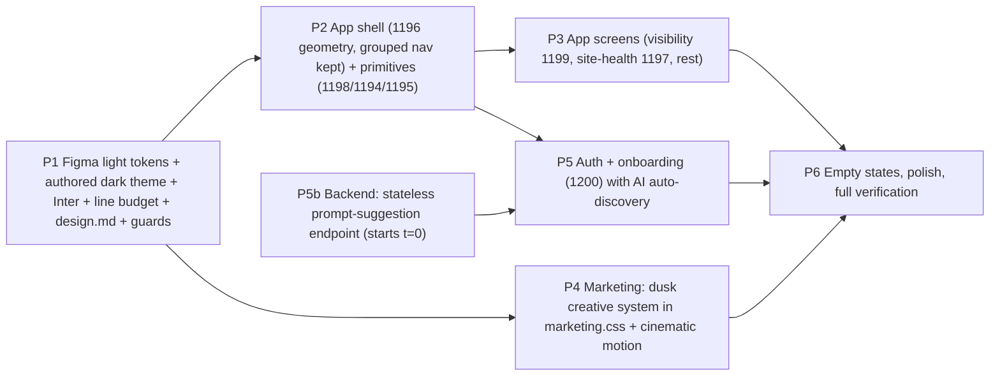

# Searchify v2 Redesign — Plan Summary

> v2 of `v1-redesign-summary.md` (v1 kept for history). Two changes drove v2: (1) the user
> provided a **Figma design system** as the app's visual source of truth, replacing "mockups
> TBD" and the Geist-based tokens; (2) **marketing scope expanded** to a complete content +
> animation refresh. v2.1 folds in the user's answers to all five open questions plus the
> marketing-independence ruling (see "Resolved decisions" below).

## Resolved decisions (user, 2026-07-25)

1. **Type**: Figma 14px-based type scale adopted **verbatim** (overrides the earlier 15–16px
   body request).
2. **Score bands**: thresholds stay **25/50/75** (`score-band.ts` unchanged); Figma band colors
   map onto the existing bands.
3. **Owned citations**: switch to **Figma blue** (green identity dropped).
4. **Nav**: **keep the grouped Analyze/Improve structure**, restyled — the Figma flat nav is
   not adopted.
5. **Dark theme**: Figma's midnight dark (`#09090F`/`#0D1228`) is **rejected** — the plan
   authors a new lighter soft-charcoal dark (Perplexity/Claude-style, never near-black); the
   light theme ports Figma values verbatim.
6. **Marketing**: "marketing pages have no relation to the app" — a fully independent creative
   system (own palette/type within premium bounds) with extremely ambitious motion scope.

## Current architecture

- `frontend/app/globals.css` (720 lines) is the app token source: `:root` light +
  `html[data-theme='dark']`, bridged via `@theme inline`; dark is the default via the
  pre-hydration bootstrap in `frontend/lib/theme.ts`.
- **The marketing creative system already exists**: `frontend/app/(marketing)/marketing.css`
  (4,689 lines) scopes styles under `.mkt`, holds the existing `--mkt-*` token block, and
  defines plain CSS classes (`hero`, `btn`, `grad-text`, `container`, `eyebrow`). CSS files
  are exempt from the no-raw-hex guard (`check-token-escapes.mjs` scans only `.ts/.tsx`).
- Guard toolchain: `app/globals.test.ts` (design.md↔globals.css name-set sync + hardcoded
  legacy palette assertions), `scripts/check-design-tokens.mjs` (required-var list),
  `scripts/check-token-escapes.mjs` (no hex / no `var()` escapes in `.ts/.tsx`),
  `scripts/check-frontend-architecture.mjs` (**globals.css hard-fails at 800 lines**).
- Shell: `(app)/layout.tsx` = SessionGuard → ProjectProvider → AppShell; grouped
  Analyze/Improve nav in `components/layout/nav-items.ts` (`e2e/shell.spec.ts` line 49 asserts
  a stale `Optimize` label). Marketing copy lives in typed modules
  (`lib/marketing-content/pricing.ts`, `faq.ts`, …). `motion` v12 (`motion/react`) is already
  a dependency, used in `landing-nav.tsx`.

## The design inputs

- **Figma artifacts govern the product app**: `tokens.css` (light tokens ported verbatim: royal
  blue ramp anchored `#2756FF`, blue-gray neutrals, status/score/run/citation/chart colors,
  4-level shadows, radii, Inter + Geist Mono — its midnight dark is NOT adopted), plus
  reference screens: `docs/redesign/figma/AppShell.tsx` AppShell (geometry only; nav grouping stays ours), `docs/redesign/figma/ScoreRing.tsx`
  ScoreRing (its 30/60/80 thresholds NOT adopted), `docs/redesign/figma/Sparkline.tsx` Sparkline, `docs/redesign/figma/VisibilityDashboard.tsx`
  VisibilityDashboard, `docs/redesign/figma/SiteHealthDetail.tsx` SiteHealthDetail, `docs/redesign/figma/DesignSystemSheet.tsx` DesignSystemSheet (type scale +
  components), `docs/redesign/figma/OnboardingScreen.tsx` OnboardingScreen.
- **Fonts switch**: Geist → **Inter** (UI, 400/500/600) + Geist Mono kept for data/numerals.
- **Type scale from Figma (`docs/redesign/figma/DesignSystemSheet.tsx`), verbatim**: hero 48/600, page title 26/600, section
  17/600, card title 15/600, body/table 14, secondary 13, caption 12, micro 11/500; mono data
  48/22/13/11. (1199's 52px hero numeral is normalized to the 48px `--text-hero` token.)
- **Approved mockups govern**: the authored dark ramp (cool slate ≈`#1C1E22` vs warm charcoal
  ≈`#2A2926`), the marketing dusk palette/type/display scale/copy, and the auth brand-panel
  layout.

## Approach

Port the Figma **light** token set into `frontend/app/globals.css` verbatim, behind the
existing semantic token names wherever one maps (new values, same names — existing component
call sites, the `@theme inline` bridge, and the guard toolchain keep working). **Author the
dark theme fresh**: soft charcoal, machine-guarded to be never-near-black with strictly
lighter elevation and AA ≥ 4.5:1 pairs. Add net-new tokens only for new concepts (blue/neutral
ramps, `--chart-1..8`, `--score-*-ring/-text`, `--text-inverse`, `--text-link` as an alias of
`--accent-text`, `--accent-active`, hero/data type sizes, `--shadow-1..4`), and **raise the
globals.css 800-line budget** in `check-frontend-architecture.mjs` to fit the ported file.
Marketing's creative system **stays in `marketing.css`**: Task 7 rewrites its `--mkt-*` token
section to the dusk palette/type and components keep consuming plain `.mkt`-scoped classes.
Rewrite `docs/design.md` as the written form of all three systems (Figma light, authored dark,
marketing `.mkt` contract) with the explicit Figma-token → Searchify-token mapping table.
Guards updated in the same P1 commit: `globals.test.ts` (new palette assertions, programmatic
AA for both app themes **and** the documented `--mkt-*` pairs with dim-tone carve-outs, dark
luminance assertions), `check-design-tokens.mjs` (scans both CSS files).

## Key design decisions

1. **Name-stable token port.** Figma light values behind existing semantic names; net-new
   tokens only for new concepts. Guard scripts and existing call sites keep compiling; the
   reskin rides on tokens + primitives, not file-by-file rewrites. The mapping table lives in
   design.md.
2. **Authored dark theme with machine-enforced constraints.** Perplexity/Claude-style soft
   charcoal; `globals.test.ts` asserts a not-near-black luminance floor, strict
   base < panel ≤ elevated ordering, and AA pairs — so the new dark can't drift into the
   near-black territory the user hates.
3. **Figma semantic flips are opt-in, not automatic.** Adopted: owned citations blue, rounded
   (non-pill) buttons. Rejected: 30/60/80 score thresholds (kept 25/50/75), flat nav (kept
   Analyze/Improve groups), midnight dark (authored fresh). Each adoption/rejection is a
   confirmed user decision encoded in the tasks.
4. **Marketing is an independent creative system — in the file it already owns.** The dusk
   palette/type/motion live in `app/(marketing)/marketing.css` (`.mkt`-scoped `--mkt-*` tokens
   + plain classes, rewritten per approved mockups); components stay hex-free; AA is enforced
   on documented `--mkt-*` pairs with large-text/decorative carve-outs for dim tones.
   Ambitious Superhuman/higoodie-class motion via one owner (`motion-primitives.tsx` —
   Reveal/Stagger/Parallax/Float/ScrollScene on `motion/react` + CSS), reduced-motion gated,
   transform/opacity only. Pricing facts stay pinned to `lib/marketing-content/pricing.ts`.
5. **Onboarding composes existing endpoints + one new stateless prompt-suggestion endpoint**
   (`POST /brand-suggestions/prompts`, mirroring its siblings: 422→503→502, workspace auth,
   nothing persisted — backend task starts at t=0), styled per `docs/redesign/figma/OnboardingScreen.tsx` (split layout +
   live preview). Confirm persists via `POST /projects` → `POST /prompt-sets` → batched prompt
   creates, and the gate is race-safe: it waits for project loading before redirecting, and
   confirm refetches the projects query before routing to `/visibility`. Manual fallback when
   the agent isn't configured.

## Risks (detail in the full plan)

- Token-name mapping has no 1:1 for every concept (4 Figma surfaces vs our 6; tertiary vs
  muted; 4 Figma shadows vs our 6) → explicit alias table in design.md; guards updated same
  commit.
- Guard tests fail on the new palettes (legacy hex assertions, required-var list, unproven
  authored-dark and dusk `--mkt-*` pairs) → P1 rewrites them with programmatic AA + dark
  luminance assertions + documented `--mkt-*` pair checks with carve-outs.
- globals.css grows past its 800-line guard budget → budget raised in P1 with a cited comment
  (marketing staying in marketing.css keeps the growth bounded).
- Authored dark theme lands wrong (too dark / washed out / sub-AA) → §3a constraints are
  machine-enforced; ramp reviewed against approved mockups before P1 closes.
- Onboarding gate race conditions (flash for users with projects, bounce-back after
  confirm) → explicit requirements (a)/(b) in Task 11 with acceptance coverage.
- Cinematic animation perf/a11y → transform/opacity only, reduced-motion static fallbacks,
  `aria-hidden` decorative scenes, lazy below-fold scenes.
- e2e selector breakage → specs updated in-phase; nav group labels stay (the stale `Optimize`
  assertion is fixed to `Improve`).
- Scope size → token-first strategy + phase parallelism (backend endpoint from t=0).

## Open questions

None blocking. Deferred to approved mockups (non-blocking): the dark family's exact ramp
(cool slate vs warm charcoal — either satisfies the §3a constraints), the marketing dusk
palette/type/display scale and final copy, and the auth brand-panel layout.
